du Vendredi 18/01/2018 au ..

# Objectifs 
Etudier la conservation du packing cristallin dans les 11 structures de PR2 et les 15 structures de PR1.
Pour cela, on va identifier les résidus qui sont : 

* inclus dans le packing cristallin chez toutes (ou la majorité (=80%)) des structures
* inclus dans le packing cristallin chez toutes (ou la majorité (=80%)) des structures de PR1
* inclus dans le packing cristallin chez toutes (ou la majorité (=80%)) des structures de PR2


# Données

* 26 fichiers qui contient les atomes impliqués dans le packing cristallin pour chaque structure de PR1 et PR2
* le type de PR pour chaque code PDB


PDB code | type | remarque
---------|------|---------
3s45 | PR2 |
1hhp | PR1 |
1hih | PR1 |
1hii | PR2 |
1hiv | PR1 |
1hpv | PR1 |
1hsh | PR2 |
1hsi | PR2 | 
1ivp | PR2 |
1sdt | PR1 | (peu avoir des pbl de numérotation des résidus)
2hb3 | PR1 |
2hb4 | PR1 | (monomère)
2hpe | PR2 |
2hpf | PR2 |
2ien | PR1 |  (peu avoir des pbl de numérotation des résidus)
2mip | PR2 |
2nph | PR1 |  (peu avoir des pbl de numérotation des résidus)
3phv | PR1 | (monomère)
2z4o | PR1 |  (peu avoir des pbl de numérotation des résidus)
3ebz | PR2 |  (peu avoir des pbl de numérotation des résidus)
3ec0 | PR2 |  (peu avoir des pbl de numérotation des résidus)
3ecg | PR2 | (peu avoir des pbl de numérotation des résidus)
3ekv | PR1 |
3nu3 | PR1 |  (peu avoir des pbl de numérotation des résidus)
4hla | PR1 |
4ll3 | PR1 |
1hsh | PR2 | 


```r
Proteases = c("1hhp","1hih","1hii","1hiv","1hpv","1hsh","1hsi","1ivp","1sdt","2hb3","2hb4","2hpe","2hpf","2ien","2mip","2nph","2z4o","3ebz","3ec0","3ecg","3ekv","3nu3","3phv","3s45","4hla","4ll3")

type = c("PR1","PR1","PR2","PR1","PR1","PR2","PR2","PR2","PR1","PR1","PR1","PR2","PR2","PR1","PR2","PR1","PR1","PR2","PR2","PR2","PR1","PR1","PR1","PR2","PR1","PR1")
names(type) = Proteases

pos.muT <-c(3,4,7,10,13,14,16,19,20,22,31:37,39:43,55:58,60:62,66:69,71:73,75:77,82,85,89,92:93,95,96,99)
res.muT <-c(paste(pos.muT,"_A",sep=""), paste(pos.muT,"_B",sep=""))
```


# Détermination des résidus impliqués dans le packing cristallin chez PR1 et PR2 

Création d'une matrice sous R qui contient en lignes les protéines et en colonnes les positions. La case de la matrice contient : 

* 1 quand le résidu a au moins 1 atomes impliqués dans le packing dans la structure, 
* 0 sinon.


Attention, 

* certaines structures sont des monomères 
* certaines structures ont des mauvaises numérotations des résidus. Normalement les résidus sont numérotés de 1 à 99 pour la chaîne A et la chaîne B. Certaines structures ont les résidus de la chaîne B numérotés de 101 à 109.
Ainsi le résidus 101B = 1B


1. Etape 1 : récupération de la liste des fichiers PDB

```r
listFile = dir("fileByProt3/")
```

2. Exemple sur le premier fichier


```r
filein = listFile[1]
M = read.table(paste("fileByProt3",filein,sep="/"))
listAtom = unique(paste(as.character(M[,6]), as.character(M[,5]), sep="_"))
listAtomSyn = listAtom
listAtomSyn
```

```
 [1] "1_A"  "2_A"  "3_A"  "4_A"  "5_A"  "6_A"  "7_A"  "8_A"  "9_A"  "23_A" "24_A" "25_A" "26_A" "27_A" "29_A" "35_A" "37_A" "42_A" "48_A" "49_A" "50_A" "51_A" "52_A" "53_A" "54_A" "55_A" "56_A" "57_A" "61_A" "67_A" "69_A" "72_A" "79_A" "87_A" "90_A" "91_A" "92_A" "93_A" "94_A" "95_A" "96_A" "97_A"
[43] "98_A" "99_A"
```


3. Récupération de la liste des résidus pour chaque protéine


```r
NbProt =(1:26)
NbResidues =(1:159)

for (i in NbProt){
  filein = listFile[i]
  M = read.table(paste("fileByProt3",filein,sep="/"))
  listAtom = unique(paste(as.character(M[,6]), as.character(M[,5]), sep="_"))
  listAtomSyn = unique(c(listAtom,listAtomSyn))
}

length(listAtomSyn)
```

```
[1] 159
```
Dans les 26 structures, il y a 159 atomes qui sont impliqués dans le packing cristallin dans au moins une structure.

4. Création de la matrice 


```r
matrice <- matrix(0, nrow=length(Proteases), ncol=length(listAtomSyn))
rownames(matrice) <- Proteases
colnames(matrice) <- listAtomSyn

for (i in 1:length(NbProt)) {
  filein = listFile[i]
  M = read.table(paste("fileByProt3",filein,sep="/"))
  Atome <- unique(c(paste(as.character(M[,6]), as.character(M[,5]), sep="_")))
  for (j in 1:length(NbResidues)) {
    for (y in 1:length(Atome)) {
      if ((listAtomSyn[j]) == (Atome[y])){
        matrice[i,j] = 1
      }
    }
  }
}

residue = colnames(matrice)
resA = residue[grep("_A", residue)]
resA_ssA = as.numeric(gsub("_A","", resA))
names(resA_ssA) = resA

sort.resA = names(sort(resA_ssA))

resB = residue[grep("_B", residue)]
resB_ssB = as.numeric(gsub("_B","", resB))
names(resB_ssB) = resB

sort.resB = names(sort(resB_ssB))

sort.res = c(sort.resA, sort.resB)
matrice.sort = matrice[,sort.res]

matrice  = matrice.sort
dim(matrice)
```

```
[1]  26 159
```

5. Coloration de la matrice  b
Utilisation la commande `pheatmap` du package `pheatmap`


```r
pheatmap(matrice[-27:-29,], cluster_rows = TRUE, cluster_cols = FALSE, br=-1:1, col=c("white", "red"),
         clustering_distance_rows = "binary")
```

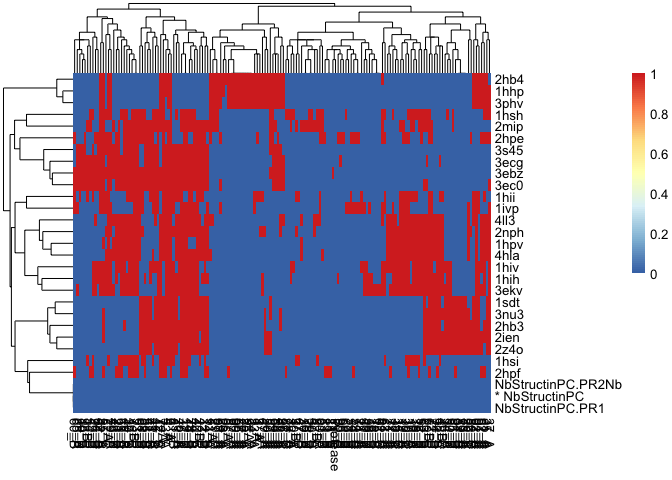

Les protéines sont classées suivant la distance 'binary' (aka asymmetric binary): The vectors are regarded as binary bits, so non-zero elements are ‘on’ and zero elements are ‘off’. The distance is the proportion of bits in which only one is on amongst those in which at least one is on.

**Analyse** :   
On voit tout d'abord : 

* les 3 formes non complexées de PR1 sont isolées ce qui s'explique par le fait qu'elles n'ont pas de chaine B
* on n'a pas une séparation PR1-PR2
* On remarque des positions qui sont impliquées dans le packing chez la majorité des structures ex 4, 6A, 7A


6. Représentation sur une structure 3D des résidus impliqués dans packing chez au moins une structure.
$\rightarrow$ liste des résidus dans le packing dans au  moins une structure de PR2
sous pymol :

1. tous les résidus impliqués dans le packing dans au moins une structure de PR
prendre les colnames de la matrice (matrice)

* ouvrir la structure de PR2 complexée avec le darunavir (DRV, code PDB 3EBZ).
* Représenter la structure en cartoon : couleur ???
* les résidus impliqués dans le packing en rouge


```r
resSelA <- gsub("_A", "", colnames(matrice)[grep("_A", colnames(matrice))])
resSel2A <- paste(resSelA, collapse="+")
paste("select respackA, resid ", resSel2A,  " and chain A", sep="")
```

```
[1] "select respackA, resid 1+2+3+4+5+6+7+8+9+10+11+12+14+15+16+17+18+19+20+21+23+24+25+26+27+29+30+34+35+36+37+38+39+40+41+42+43+44+45+46+47+48+49+50+51+52+53+54+55+56+57+58+59+60+61+63+65+66+67+68+69+70+71+72+73+74+78+79+80+81+82+87+88+89+90+91+92+93+94+95+96+97+98+99 and chain A"
```

```r
resSelB <- gsub("_B", "", colnames(matrice)[grep("_B", colnames(matrice))])
resSel2B <- paste(resSelB, collapse="+")
paste("select respackB, resid ", resSel2B,  " and chain B", sep="")
```

```
[1] "select respackB, resid 1+2+3+4+6+7+8+10+11+12+13+14+16+17+18+19+20+21+29+30+34+35+36+37+38+39+40+41+42+43+44+45+46+47+48+49+50+51+52+53+54+55+56+57+58+59+60+61+62+63+65+67+68+69+70+71+72+73+74+76+78+79+80+81+82+83+87+88+91+92+94+95+96+98+99 and chain B"
```
"select respackB, resid 101+102+103+104+106+107+108+110+111+112+113+114+116+117+118+119+120+121+129+130+134+135+136+137+138+139+140+141+142+143+144+145+146+147+148+149+150+151+152+153+154+155+156+157+158+159+160+161+162+163+165+167+168+169+170+171+172+173+174+176+178+179+180+181+182+183+187+188+191+192+194+195+196+198+199 and chain B"

**To do**


7. Représentation sur une structure 3D des résidus impliqués dans packing conservés entre toutes les structures.
**To do**


## Etude du type d'atomes impliqués dans le packing cristallin 

On se demande quels types d'atomes sont impliqués dans le packing cristallin : atomes des chaines latérales ou du backbone ?


```r
list.bk = c("C","O","N","CA")
Localisation = c("Backbone","ChaineLat")
NbAtomeinPC = 1:6039  ##Il faudrait automatiser ces valeurs

matrice3 <- matrix(0, nrow=length(Localisation), ncol=length(NbResidues))

rownames(matrice3) <- Localisation
colnames(matrice3) <- sort.res

listAtomSyn = c()
for (i in NbProt){
  filein = listFile[i]
  N = read.table(paste("fileByProt3",filein,sep="/"))
  listAtom = (paste(as.character(N[,6]), as.character(N[,5]), sep="_"))
  listAtomSyn = (c(listAtom,listAtomSyn))
}

listAtomSyn2 = c()

for (i in NbProt){
  filein = listFile[i]
  N = read.table(paste("fileByProt3",filein,sep="/"))
  listAtom = (paste(as.character(N[,3])))
  listAtomSyn2 = (c(listAtom,listAtomSyn2))
}

names(listAtomSyn) = listAtomSyn2

for (j in 1:length(sort.res)) {
  for (k in 1:length(NbAtomeinPC)) {
    
    if (sort.res[j] == listAtomSyn[k]){
    
      #if ((((listAtomSyn2)[k]) =="C") || (((listAtomSyn2)[k]) == "CA") || (((listAtomSyn2)[k]) == "O") || (((listAtomSyn2)[k]) == "N")){
      if (is.element(listAtomSyn2[k], list.bk)==TRUE){
       
       matrice3[1,sort.res[j]] = matrice3[1,sort.res[j]] + 1
       }else{
         matrice3[2,sort.res[j]] = matrice3[2,sort.res[j]] + 1
       }
    }
  }
}
```

En moyenne on a : 

```r
apply(matrice3, 1, mean)
```

```
 Backbone ChaineLat 
 13.44025  24.54088 
```

```r
t.test(matrice3[1,],matrice3[2,], var.equal=TRUE, alternative="less")
```

```

	Two Sample t-test

data:  matrice3[1, ] and matrice3[2, ]
t = -3.9373, df = 316, p-value = 0.00005071
alternative hypothesis: true difference in means is less than 0
95 percent confidence interval:
      -Inf -6.449546
sample estimates:
mean of x mean of y 
 13.44025  24.54088 
```
On voit qu'en moyenne les résidus ont plus d'atomes des chaînes latérales impliqués dans le packing cristallin que des atomes du backbone (p-value = 5.071e-05).


```r
plot(matrice3[1,],matrice3[2,], xlab="nbr d'atomes du backbone impliqués dans le packing par résidu",
    ylab="nbr d'atomes des chaines latérales impliqués dans le packing par résidu", pch=19)
```

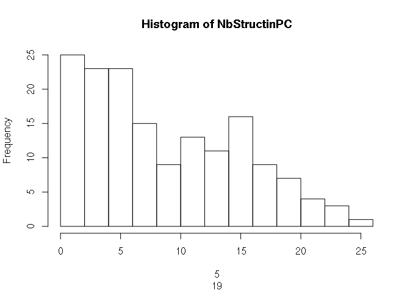

On voit qu'il n'y a pas de lien entre le nombre d'atomes du backbone impliqués dans le packing par résidus et le 
 nombre d'atomes des chaînes latérales impliqués dans le packing par résidus.
 Ce n'est pas parce qu'un résidu à beaucoup d'atomes de sa chaîne latérale impliqués dans le packing, qu'il aura beaucoup d'atomes de son backbone impliqués dans le packing.
 

Visualisation du type d'atomes impliqués dans le packing cristallin

```r
pheatmap(matrice3, cluster_cols = FALSE, cluster_rows = FALSE, breaks = c(-1, 10, 20, 50, 100, 250),
         col = c("white", "wheat", "yellow", "orange", "red"))
```

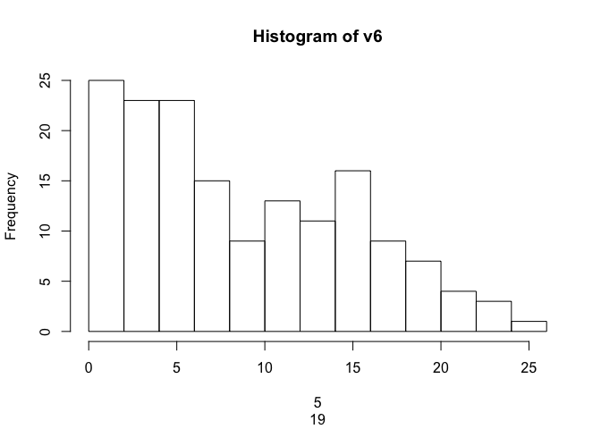


A refaire pour le nombre de protéine : matrice avec des 0 et 1


```r
matriceBackBonePR <- matrix(0, nrow=length(Proteases), ncol=length(NbResidues))

rownames(matriceBackBonePR) <- Proteases
colnames(matriceBackBonePR) <- sort.res

matriceChaineLatPR <- matrix(0, nrow=length(Proteases), ncol=length(NbResidues))

rownames(matriceChaineLatPR) <- Proteases
colnames(matriceChaineLatPR) <- sort.res


NbAtomeinPC = c(1:length(listAtomSyn2))
names(listAtomSyn) = listAtomSyn2
for (i in 1:length(Proteases)) {
  
  listAtomSyn = NULL
  listAtomSyn2 = NULL
  
  
  filein = listFile[i]
  N = read.table(paste("fileByProt3",filein,sep="/"))
  
  listAtomSyn = (paste(as.character(N[,6]), as.character(N[,5]), sep="_"))
  
  listAtomSyn2 = (paste(as.character(N[,3])))
  
  for (k in 1:length(listAtomSyn)) {
    for (j in 1:length(sort.res)) {
      
      if (listAtomSyn[k] == sort.res[j]){
        if (is.element(listAtomSyn2[k], list.bk)==TRUE){
       
         matriceBackBonePR[Proteases[i],sort.res[j]] = 1
        }else{
         matriceChaineLatPR[Proteases[i],sort.res[j]] = 1
        }
      }
    }
  }
}
```

Visualisation des résultats


```r
pheatmap(matriceBackBonePR[-27:-29,], cluster_rows = TRUE, cluster_cols = FALSE, br=-1:1, 
         col=c("white", "red"), clustering_distance_rows = "binary")
```

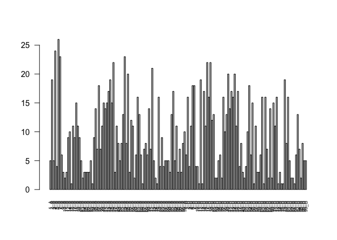

```r
pheatmap(matriceChaineLatPR[-27:-29,], cluster_rows = TRUE, cluster_cols = FALSE, br=-1:1, 
         col=c("white", "red"), clustering_distance_rows = "binary")
```


## Détermination du nombre de structures dans lequel un résidu est impliqué dans le packing cristallin
Le  nombre de structure dans lequel un résidu est impliqué dans le packing cristallin = la somme des colonnes de la matrice

1. Calculer le nombre de structure dans lequel un résidu est impliqué dans le packing cristallin


```r
StructinPC = c("NbStructinPC","NbStructinPC.PR1","NbStructinPC.PR2")

matriceStruct <- matrix(0, nrow=length(StructinPC), ncol=length(sort.res))

rownames(matriceStruct) <- StructinPC
colnames(matriceStruct) <- sort.res


for (i in 1:length(NbResidues)){
  y = 0
  for (j in 1:length(Proteases[1:26])) {
    if (matrice[j,i] == 1){
        y = y+1
        matriceStruct[1,i] = y
    }
  }
}
```

Voir si ces deux lignes de codes sont nécessaires, car le vecteur type existe déjà mais ne contient pas les mêmes données

```r
type = matrice[,ncol(matrice)]
names(type)
```

```
 [1] "1hhp" "1hih" "1hii" "1hiv" "1hpv" "1hsh" "1hsi" "1ivp" "1sdt" "2hb3" "2hb4" "2hpe" "2hpf" "2ien" "2mip" "2nph" "2z4o" "3ebz" "3ec0" "3ecg" "3ekv" "3nu3" "3phv" "3s45" "4hla" "4ll3"
```

```r
#matrice[names(which(type=="PR2")),]
```


```r
matrice2 = matrice[,-ncol(matrice)]
```


```r
NbStructinPC = apply(matrice[1:26,],2,sum)
```

D'après ces résultats on voit que le résidus 6_A est impliqués dans le packing cristallin dans toutes les structures.

D'autres résidus sont retrouvés dans la majorité des structures (>80%) : 4_A, 6_A, 7_A, 46_A, 53_A, 72_A, 17_B, 19_B


2. Représenter ces valeurs graphiquement

```r
hist(NbStructinPC,xlab="Nbr de structures ayant un résidu donné impliqué dans le packing")
```

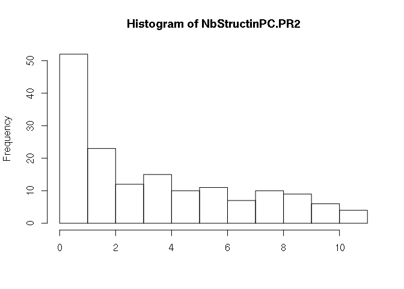

On va aussi faire un barplot pour voir le nombre pour chaque résidus

```r
barplot(NbStructinPC, las = 2, cex.names  = 0.6, xlab="residus", ylab="Nbr de structures ayant un résidu donné impliqué dans le packing")
abline(h=c(19,17))
```


 On voit des différences dans les chaînes A et B
 
 

3. Calculer la moyenne et écart type de ce nombre


```r
mean(matriceStruct[1,])
```

```
[1] 9.157233
```

```r
sd(matriceStruct[1,])
```

```
[1] 6.383855
```


On définit un résidus impliqué dans le packing dans la majorité des structures comme étant : 

* les résidus de la chaine A vu dans au moins 70% des structures = 19 structures
* les résidus de la chaine B vu dans au moins 70% des structures = 17 structures


4. Calcul une p-value pour déterminer si les positions sont conservées


```r
f.permut = function(vect){
  return(sample(vect))
}

occ <- apply(matrice,2,sum)

resA <- colnames(matrice)[grep("_A", colnames(matrice))]
resB<- colnames(matrice)[grep("_B", colnames(matrice))]

nbrSimul <- 10000

occ.SupbyPos <- rep(0, length = ncol(matrice))
names(occ.SupbyPos) <- colnames(matrice)
for( rep in 1:nbrSimul){
    mat.rand.A <- t(apply(matrice[,resA],1,f.permut))
    mat.rand.B <- t(apply(matrice[,resB],1,f.permut))
    matrice.random <- cbind(mat.rand.A, mat.rand.B)
    colnames(matrice.random) <- c(resA,resB)
    occ.rand <- apply(matrice.random,2,sum)
    diff <- occ.rand-occ
    occ.SupbyPos [names(which(diff > 0))] = occ.SupbyPos[names(which(diff > 0))] +1
}

pval <- occ.SupbyPos/nbrSimul
```

Les positions qui sont sur-représentés sont (pvalue < 0.05) 2_A, 4_A, 6_A, 7_A, 18_A, 35_A, 37_A, 40_A, 41_A, 42_A, 43_A, 44_A, 45_A, 46_A, 52_A, 53_A, 55_A, 61_A, 63_A, 70_A, 72_A, 79_A, 91_A, 92_A, 2_B, 6_B, 7_B, 12_B, 14_B, 17_B, 18_B, 19_B, 21_B, 37_B, 39_B, 40_B, 41_B, 42_B, 43_B, 44_B, 46_B, 53_B, 55_B, 61_B, 63_B, 68_B, 70_B, 72_B, 79_B, 81_B, 92_B.
Ces positions sont impliquées dans le packing dans la majorité des structures.


# Détermination des résidus impliqués dans le packing cristallin chez PR1

## Identification des résidus impliqués dans le packing cristallin chez au moins une structure de PR1
1. Matrice ne contenant que des protéines PR1


```r
type = c("PR1","PR1","PR2","PR1","PR1","PR2","PR2","PR2","PR1","PR1","PR1","PR2","PR2","PR1","PR2","PR1","PR1","PR2","PR2","PR2","PR1","PR1","PR1","PR2","PR1","PR1")
names(type) = Proteases


ProtPR1 <- names(which(type=="PR1"))
MatricePR1 <- matrice[ProtPR1,]
```


2. Calcul de la significativité 

```r
nbrSimul <- 10000

f.computPval <- function(MatricePR1, nbrSimul){
    occ.PR1 <- apply(MatricePR1,2,sum)
    resA <- colnames(MatricePR1)[grep("_A", colnames(MatricePR1))]
    resB <- colnames(MatricePR1)[grep("_B", colnames(MatricePR1))]
    
    occ.SupbyPos.PR1 <- rep(0, length = ncol(MatricePR1))
    names(occ.SupbyPos.PR1) <- colnames(MatricePR1)
    
    for( rep in 1:nbrSimul){
       mat.rand.A <- t(apply(MatricePR1[,resA],1,f.permut))
       mat.rand.B <- t(apply(MatricePR1[,resB],1,f.permut))
       matrice.random <- cbind(mat.rand.A, mat.rand.B)
       colnames(matrice.random) <- c(resA,resB)
       occ.rand <- apply(matrice.random,2,sum)
       diff <- occ.rand-occ.PR1
       occ.SupbyPos.PR1 [names(which(diff > 0))] = occ.SupbyPos.PR1[names(which(diff > 0))] +1
    }

    pval.PR1 <- occ.SupbyPos.PR1/nbrSimul
    return(pval.PR1)
}

pval.PR1 <- f.computPval(MatricePR1, nbrSimul=20000)
  
length(which(pval.PR1 < 0.05/ncol(MatricePR1)))
```

```
[1] 24
```

```r
res.conserv.PR1 <- names(which(pval.PR1 < 0.05))
```

Chez PR1, il y a 41 résidus qui sont impliqués dans le packing cristallin dans la majorité des PR1.


On regarde dans combien de structures de PR1 ses résidus sont impliqués dans le packing


```r
occ.PR1 <- apply(MatricePR1,2,sum)
occ.PR1[res.conserv.PR1]
```

```
 2_A  4_A  6_A  7_A 18_A 35_A 37_A 43_A 44_A 46_A 52_A 53_A 55_A 61_A 70_A 72_A 79_A 91_A 92_A 94_A  2_B  4_B  6_B 12_B 14_B 17_B 18_B 19_B 40_B 42_B 43_B 44_B 61_B 63_B 70_B 71_B 72_B 79_B 80_B 81_B 92_B 
  10   15   15   12   12   12   14   11   11   12   11   14   10   12    9   15    9   11   15    9    8   10   12   11   10   12    8   12   12    8    9   11    9   12   11   11   12   11    8    9   12 
```


On regarde dans combien de structures de PR1 ses résidus sont impliqués dans le packing
Il faut différentier les chaînes A et B, car trois structures de PR1 n'ont pas de chaîne B.


```r
resA.1 <- intersect(res.conserv.PR1, colnames(MatricePR1)[grep("_A", colnames(MatricePR1))])
resB.1 <- intersect(res.conserv.PR1, colnames(MatricePR1)[grep("_B", colnames(MatricePR1))])

pourc.PR1 <- round(c(occ.PR1[resA.1] / nrow(MatricePR1),
                     occ.PR1[resB.1] / (nrow(MatricePR1)-3))*100,2)

barplot(pourc.PR1, las=2, ylab="% de structures avec le res dans packing")
```

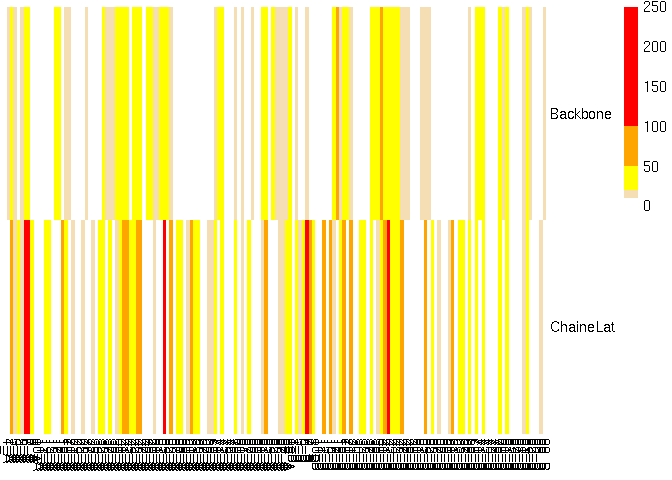

Ces résidus conservés dans le packing de PR1 sont impliqués dans le packing dans 11.15 (+/- 1.98) structures.


3. Représentation sur une structure 3D des résidus impliqués dans le packing cristallin spécifiques de PR1

* Pour la visualisation utiliser la structure de PR1 complexée au DRV : PDB code : 2ien.
* résidus impliqués dans le packing cristallin spécifiques de PR1 = Résidus ceux qui sont très souvent impliqués dans le packing chez PR1 et très peu voir jamais chez PR2 

Bien lister les résidus qui ont été colorés et comment ils ont été sélectionnés : quel seuil ?


```r
resSel_A_PR1 <- gsub("_A", "", colnames(matrice)[grep("_A", colnames(matrice))])
resSel2_A_PR1 <- paste(resSel_A_PR1, collapse="+")
paste("select respackA, resid ", resSel2_A_PR1,  " and chain A", sep="")
```

```
[1] "select respackA, resid 1+2+3+4+5+6+7+8+9+10+11+12+14+15+16+17+18+19+20+21+23+24+25+26+27+29+30+34+35+36+37+38+39+40+41+42+43+44+45+46+47+48+49+50+51+52+53+54+55+56+57+58+59+60+61+63+65+66+67+68+69+70+71+72+73+74+78+79+80+81+82+87+88+89+90+91+92+93+94+95+96+97+98+99 and chain A"
```

```r
#type[rownames(matrice)[j]] == "PR1"
```


```r
count.allPR <- apply(matrice, 2, sum)
hist(count.allPR)
```

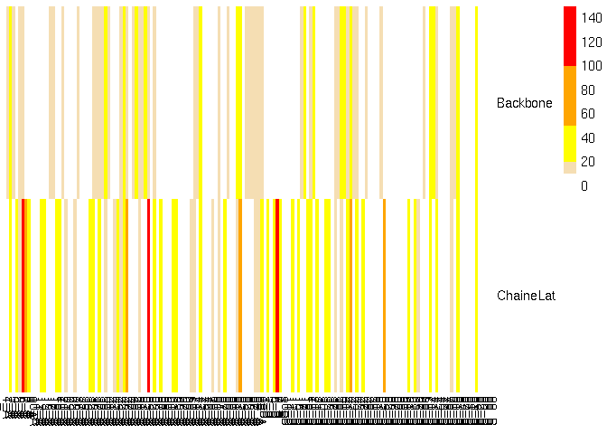

```r
dim(matrice)
```

```
[1]  26 159
```

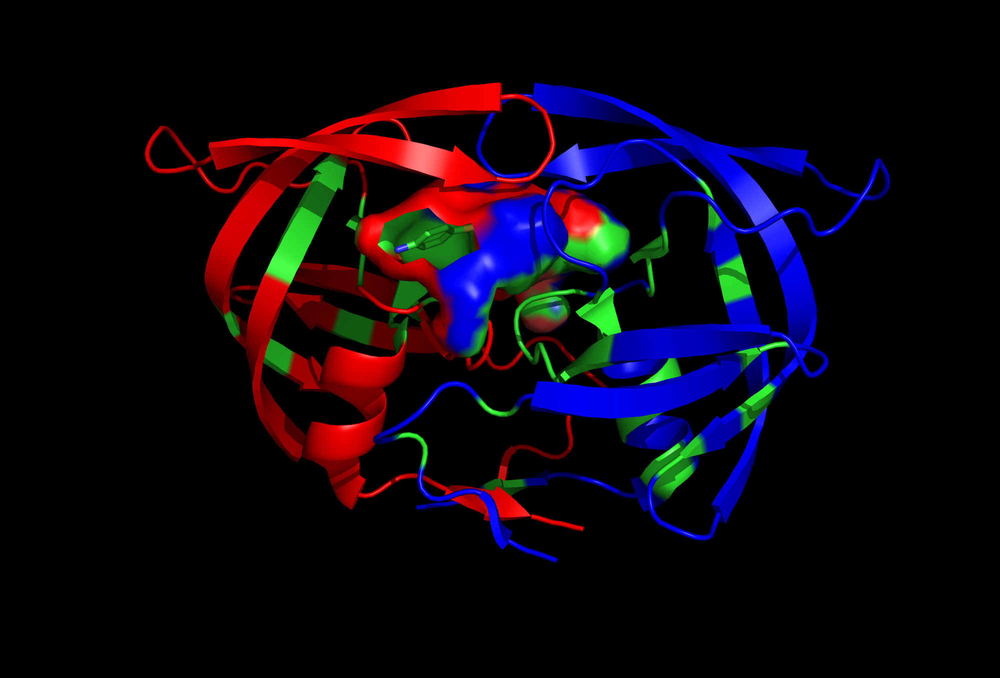{width=65%}


## Calcul du nombre de structure dans lequel un résidu est impliqué dans le packing cristallin pour les PR1

1. Calculer le nombre de structure dans lequel un résidu est impliqué dans le packing cristallin pour les PR1


```r
##version courte
NbStructinPC = apply(matrice,2,sum)

ind.PR1 = names(which(type == "PR1"))
NbStructinPC.PR1 = apply(matrice[ind.PR1,],2,sum)

matriceStruct = rbind(NbStructinPC,NbStructinPC.PR1)
```


2. Représenter ces valeurs graphiquement


```r
hist(NbStructinPC.PR1, xlab = matriceStruct[1,])
```

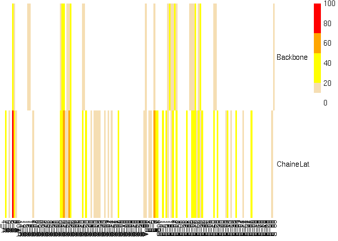

```r
barplot(NbStructinPC.PR1, las = 2, cex.names  = 0.6)
```

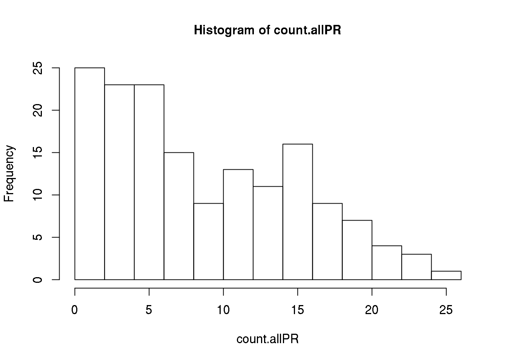


3. Calculer la moyenne et écart type de ce nombre


```r
mean(matriceStruct["NbStructinPC.PR1",])
```

```
[1] 5.408805
```

```r
sd(matriceStruct["NbStructinPC.PR1",])
```

```
[1] 4.182867
```

## Etude du type d'atomes impliqués dans le packing cristallin chez PR1


```r
Localisation = c("Backbone","ChaineLat")

matrice3PR1 <- matrix(0, nrow=length(Localisation), ncol=length(NbResidues))

rownames(matrice3PR1) <- Localisation
colnames(matrice3PR1) <- sort.res

type.file = c("PR1","PR1","PR2","PR1","PR1","PR2","PR2","PR2","PR1","PR1","PR1","PR2","PR2","PR1","PR2","PR1","PR1","PR2","PR2","PR2","PR1","PR1","PR1","PR2","PR1","PR1")

names(type.file ) =c("1hhp_packCryst.pdb","1hih_packCryst.pdb","1hii_packCryst.pdb","1hiv_packCryst.pdb","1hpv_packCryst.pdb","1hsh_packCryst.pdb","1hsi_packCryst.pdb","1ivp_packCryst.pdb","1sdt_packCryst.pdb","2hb3_packCryst.pdb","2hb4_packCryst.pdb","2hpe_packCryst.pdb","2hpf_packCryst.pdb","2ien_packCryst.pdb","2mip_packCryst.pdb","2nph_packCryst.pdb","2z4o_packCryst.pdb","3ebz_packCryst.pdb","3ec0_packCryst.pdb","3ecg_packCryst.pdb","3ekv_packCryst.pdb","3nu3_packCryst.pdb","3phv_packCryst.pdb","3s45_packCryst.pdb","4hla_packCryst.pdb","4ll3_packCryst.pdb")
ind.PR1 = names(which(type.file == "PR1"))


#ici je ne comprends pas pourquoi vous faites une double boucle
listAtomSyn = c()

listAtomSyn = NULL
listAtomSyn2 = NULL

pp =NULL

for (j in NbProt) {
  for (i in 1:length(ind.PR1)){
    filein = listFile[j]
    N = read.table(paste("fileByProt3",filein,sep="/"))
    if((filein) == (ind.PR1[i])){
      pp = c(pp, filein)
      listAtom = (paste(as.character(N[,6]), as.character(N[,5]), sep="_"))
      listAtomSyn = (c(listAtom,listAtomSyn))
    }
  }
}


for (j in NbProt){
  for (i in 1:length(ind.PR1)) {
    filein = listFile[j]
    
    if((filein) == (ind.PR1[i])){
      N = read.table(paste("fileByProt3",filein,sep="/"))
      listAtom = (paste(as.character(N[,3])))
      listAtomSyn2 = (c(listAtom,listAtomSyn2))
    }
  }
}

NbAtomeinPC.1 = c(1:length(listAtomSyn2))
names(listAtomSyn) = listAtomSyn2

for (j in 1:length(sort.res)) {
  for (k in 1:length(NbAtomeinPC.1)) {
    
    if (sort.res[j] == listAtomSyn[k]){
    
      if ((((listAtomSyn2)[k]) =="C") || (((listAtomSyn2)[k]) == "CA") || (((listAtomSyn2)[k]) == "O") || (((listAtomSyn2)[k]) == "N")){
       
       matrice3PR1[1,sort.res[j]] = matrice3PR1[1,sort.res[j]] + 1
       }else{
         matrice3PR1[2,sort.res[j]] = matrice3PR1[2,sort.res[j]] + 1
       }
    }
  }
}
```


```r
pheatmap(matrice3PR1, cluster_cols = FALSE, cluster_rows = FALSE, breaks = c(-1, 10, 20, 50, 100, 150), col = c("white", "wheat", "yellow", "orange", "red"))
```

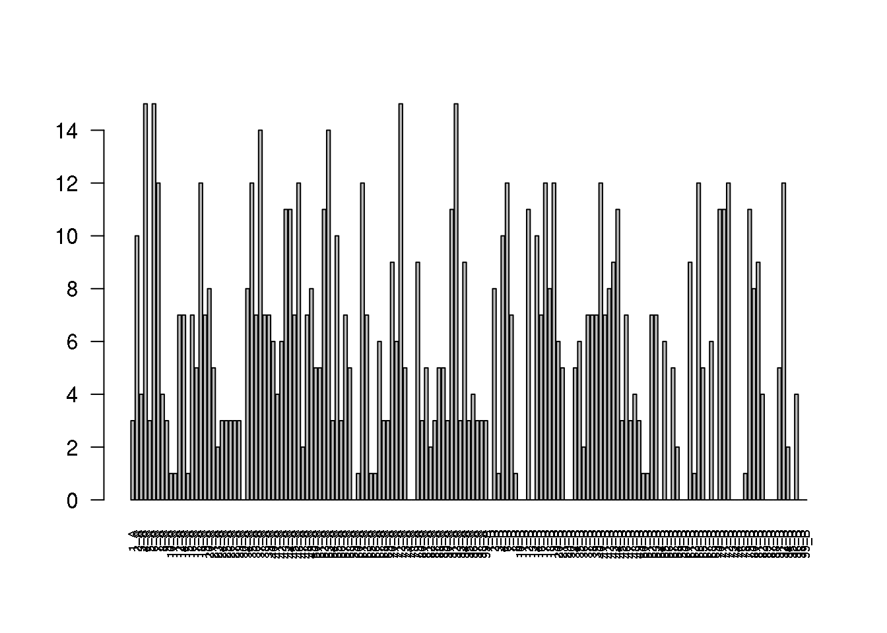


A refaire pour le nombre de protéine : matrice avec des 0 et 1 pour PR1

```r
ProtPR1 = c("1hhp","1hih","1hiv","1hpv","1sdt", "2hb3","2hb4","2ien","2nph","2z4o","3ekv","3nu3","3phv","4hla","4ll3")

list.bk = c("C","O","N","CA")

matriceBackBonePR1 <- matrix(0, nrow=length(ProtPR1), ncol=length(NbResidues))

rownames(matriceBackBonePR1) <- ProtPR1
colnames(matriceBackBonePR1) <- sort.res

matriceChaineLatPR1 <- matrix(0, nrow=length(ProtPR1), ncol=length(NbResidues))

rownames(matriceChaineLatPR1) <- ProtPR1
colnames(matriceChaineLatPR1) <- sort.res


NbAtomeinPC = c(1:length(listAtomSyn2))
names(listAtomSyn) = listAtomSyn2
for (i in 1:length(ind.PR1)) {
  
  listAtomSyn = NULL
  listAtomSyn2 = NULL
  
  
  filein = ind.PR1[i]
  N = read.table(paste("fileByProt3",filein,sep="/"))
  
  listAtomSyn = (paste(as.character(N[,6]), as.character(N[,5]), sep="_"))
  
  listAtomSyn2 = (paste(as.character(N[,3])))
  
  for (k in 1:length(listAtomSyn)) {
    for (j in 1:length(sort.res)) {
      
      if (listAtomSyn[k] == sort.res[j]){
        if (is.element(listAtomSyn2[k], list.bk)==TRUE){
       
         matriceBackBonePR1[ProtPR1[i],sort.res[j]] = 1
        }else{
         matriceChaineLatPR1[ProtPR1[i],sort.res[j]] = 1
        }
      }
    }
  }
}
```


```r
pheatmap(matriceBackBonePR1[-27:-29,], cluster_rows = TRUE, cluster_cols = FALSE, br=-1:1, col=c("white", "red"))
```


```r
pheatmap(matriceChaineLatPR1[-27:-29,], cluster_rows = TRUE, cluster_cols = FALSE, br=-1:1, col=c("white", "red"))
```


# Détermination des résidus impliqués dans le packing cristallin chez PR1


## Identification des résidus impliqués dans le packing cristallin dans au moins une structure de PR2
1. Calcul de la matrice donnant si le résidu est impliqué dans le packing chez une des structures de PR2


```r
type = c("PR1","PR1","PR2","PR1","PR1","PR2","PR2","PR2","PR1","PR1","PR1","PR2","PR2","PR1","PR2","PR1","PR1","PR2","PR2","PR2","PR1","PR1","PR1","PR2","PR1","PR1")
names(type) = Proteases

ProtPR2 = names(which(type=="PR2"))

MatricePR2 <- matrice[ProtPR2,]
dim(MatricePR2)
```

```
[1]  11 159
```

2. Calcul de la significativité pour déterminer les résidus conservés


```r
pval.PR2 <- f.computPval(MatricePR2, nbrSimul=20000)
res.conserv.PR2 <- names(which(pval.PR2 < 0.05))
```

Chez PR2, il y a 40 résidus qui sont impliqués dans le packing cristallin dans la majorité des PR2.


On regarde dans combien de structures de PR1 ses résidus sont impliqués dans le packing


```r
occ.PR2 <- apply(MatricePR2,2,sum)
occ.PR2[res.conserv.PR2]
```

```
 2_A  4_A  6_A  7_A 40_A 41_A 42_A 43_A 44_A 45_A 46_A 53_A 55_A 58_A 63_A 72_A 79_A 99_A  2_B  7_B 12_B 14_B 17_B 18_B 19_B 21_B 37_B 40_B 41_B 42_B 43_B 44_B 45_B 46_B 53_B 55_B 61_B 68_B 79_B 81_B 
   9    9   11   11    9   10    9    6    8    8   10    9   10    6    6    6    7    7    8   11    8    7   10    8   10    8    9    8    7    9    7    9    8   10   11    9    7    8    8    7 
```

On calcule le pourcentage de structures de PR2 contenant ces résidus dans le packing


```r
pourc.PR2 <- round(occ.PR2[res.conserv.PR2] / nrow(MatricePR2)*100,2)
barplot(pourc.PR2, las=2, ylab="% de structures avec le res dans packing")
```


Ces résidus conservés dans le packing de PR2 sont impliqués dans le packing dans 8.45 (+/- 1.47) structures.


3. Représentation sur une structure 3D des résidus impliqués dans le packing cristallin spécifiques de PR2

* Pour la visualisation utiliser la structure de PR2 complexée au DRV : PDB code : 3EBZ.
* résidus impliqués dans le packing cristallin spécifiques de PR2 = Résidus ceux qui sont très souvent impliqués dans le packing chez PR2 et très peu voir jamais chez PR1  

Bien lister les résidus qui ont été colorés et comment ils ont été sélectionnés : quel seuil ?


## Calcul du nombre de structures de PR2 dans lequel un résidu est impliqué dans le packing cristallin

1. Calculer le nombre de structure dans lequel un résidu est impliqué dans le packing cristallin pour les PR2


```r
ind.PR2 = names(which(type == "PR2"))

NbStructinPC.PR2 = apply(matrice[ind.PR2,],2,sum)

matriceStruct = rbind(matriceStruct,NbStructinPC.PR2)
```

2. Représenter ces valeurs graphiquement


```r
hist(NbStructinPC.PR2,xlab = "")
```


```r
barplot(NbStructinPC.PR2, las = 2, cex.names  = 0.6)
```

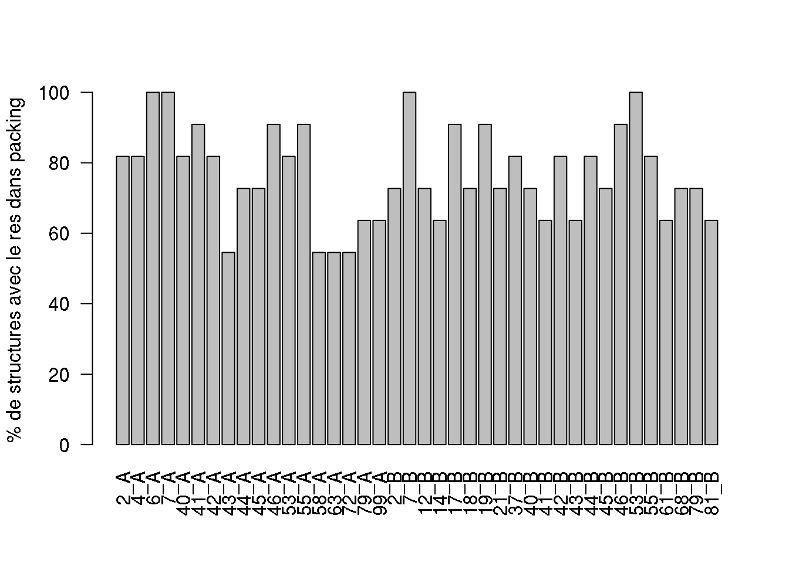


3. Calculer la moyenne et écart type de ce nombre


```r
mean(matriceStruct["NbStructinPC.PR2",])
```

```
[1] 3.748428
```

```r
sd(matriceStruct["NbStructinPC.PR2",])
```

```
[1] 3.25298
```

## Type d'atomes impliqués dans le packing cristallin chez PR2


```r
Localisation = c("Backbone","ChaineLat")

matrice3PR2 <- matrix(0, nrow=length(Localisation), ncol=length(NbResidues))

rownames(matrice3PR2) <- Localisation
colnames(matrice3PR2) <- sort.res

ind.PR2 = names(which(type.file == "PR2"))

listAtomSyn2 = NULL
listAtomSyn = NULL

listAtomSyn = c()
for (j in NbProt) {
  for (i in 1:length(ind.PR2)){
    filein = listFile[j]
    if((filein) == (ind.PR2[i])){
      N = read.table(paste("fileByProt3",filein,sep="/"))
      listAtom = (paste(as.character(N[,6]), as.character(N[,5]), sep="_"))
      listAtomSyn = (c(listAtom,listAtomSyn))
    }
  }
}


for (j in NbProt){
  for (i in 1:length(ind.PR2)) {
    filein = listFile[j]
    if((filein) == (ind.PR2[i])){
      N = read.table(paste("fileByProt3",filein,sep="/"))
      listAtom = (paste(as.character(N[,3])))
      listAtomSyn2 = (c(listAtom,listAtomSyn2))
    }
  }
}

NbAtomeinPC.2 = c(1:length(listAtomSyn2))
list.bk = c("C","CA","N","O")
names(listAtomSyn) = listAtomSyn2

for (j in 1:length(sort.res)) {
  for (k in 1:length(NbAtomeinPC.2)) {
    
    if (sort.res[j] == listAtomSyn[k]){
    
      #if ((((listAtomSyn2)[k]) =="C") || (((listAtomSyn2)[k]) == "CA") || (((listAtomSyn2)[k]) == "O") || (((listAtomSyn2)[k]) == "N")){
      if (is.element(listAtomSyn2[k], list.bk)==TRUE){
       
       matrice3PR2[1,sort.res[j]] = matrice3PR2[1,sort.res[j]] + 1
       }else{
         matrice3PR2[2,sort.res[j]] = matrice3PR2[2,sort.res[j]] + 1
       }
    }
  }
}
matrice3PR2
```

```
          1_A 2_A 3_A 4_A 5_A 6_A 7_A 8_A 9_A 10_A 11_A 12_A 14_A 15_A 16_A 17_A 18_A 19_A 20_A 21_A 23_A 24_A 25_A 26_A 27_A 29_A 30_A 34_A 35_A 36_A 37_A 38_A 39_A 40_A 41_A 42_A 43_A 44_A 45_A 46_A 47_A 48_A 49_A 50_A 51_A 52_A 53_A 54_A 55_A 56_A 57_A 58_A 59_A 60_A 61_A 63_A 65_A 66_A 67_A
Backbone    4   6   0   1   1  25  12   0   0    0    0    1    0    0   13   18    2    2    2    0    0    0    0    0    0    4    0    2    2    0    0    0   10   18   23   24    9   12   16   27    0    8    0    0    5    2   19   15    5    0    0    0    0    2    3    0    0    0    0
ChaineLat   2  22   2  19   0  93  46  11   0    1    2    2   10    0   10    0    7   11    2    0    0    0    0    0    0   10    6    1    0    0   10    0    0   23   42   51   16   18   52   27    1    0    0    0    0    0   43    0   31    0   10   12    4   15   14   15   19    0    1
          68_A 69_A 70_A 71_A 72_A 73_A 74_A 78_A 79_A 80_A 81_A 82_A 87_A 88_A 89_A 90_A 91_A 92_A 93_A 94_A 95_A 96_A 97_A 98_A 99_A 1_B 2_B 3_B 4_B 6_B 7_B 8_B 10_B 11_B 12_B 13_B 14_B 16_B 17_B 18_B 19_B 20_B 21_B 29_B 30_B 34_B 35_B 36_B 37_B 38_B 39_B 40_B 41_B 42_B 43_B 44_B 45_B 46_B 47_B
Backbone     2    2    2    1    2    0    0    2    7    4    6    0    0    0    0    0    2    3    4    4    0    0    0    7   14   6  10   1   0  11   7   2    0    1    6    4    0   13   36   15   13   22   14    0    0    0    0    0   10    8   15   17   20   24    6   20   21    9    3
ChaineLat   15    4   18    0   14    0    3    0   22    0    4    3    3    0    0    0    0    0    0    0    0    3    0   18   11   7  18  11   2  51  45  21    4    0   22    0   40   19    0   20   30    2   38    6    5    0    0    0   25    0    0   32   34   41   18   26   14   28    0
          48_B 49_B 50_B 51_B 52_B 53_B 54_B 55_B 56_B 57_B 58_B 59_B 60_B 61_B 62_B 63_B 65_B 67_B 68_B 69_B 70_B 71_B 72_B 73_B 74_B 76_B 78_B 79_B 80_B 81_B 82_B 83_B 87_B 88_B 91_B 92_B 94_B 95_B 96_B 98_B 99_B
Backbone     8    0    1    6    8   16   15    8    4    0    0    0    2    4    0    0    0    3    7    0    0    0    2    4    2    0    0    7    0    8    0    0    2    4    3    2    9    3    2    0   13
ChaineLat    0    0    0    0    0   39    7   34    0   10    3    3   16   21    0   15    7    4   30    8    6    0   15    0    7    1    0   22    0   10    1    2    4    3    2    1    0    0    6   19    4
```

```r
matricetotale = matrice3PR1 + matrice3PR2
```

```r
pheatmap(matrice3PR2, cluster_cols = FALSE, cluster_rows = FALSE, breaks = c(-1, 10, 20, 50, 70, 100), col = c("white", "wheat", "yellow", "orange", "red"))
```

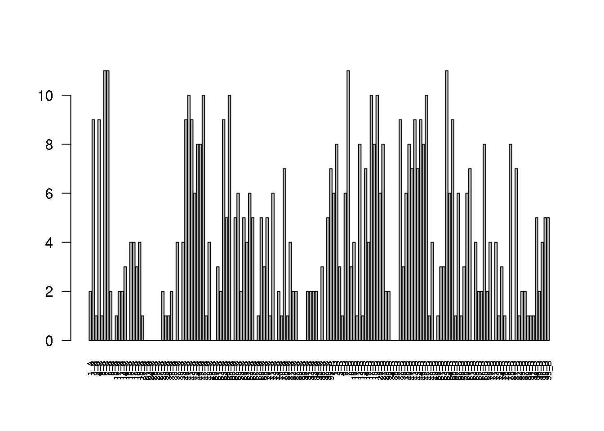


A refaire pour le nombre de protéine : matrice avec des 0 et 1 pour PR2


```r
ProtPR2 = c("1hii","1hsh","1hsi","1ivp","2hpe","2hpf","2mip","3ebz","3ec0","3ecg","3s45")

list.bk = c("C","O","N","CA")

matriceBackBonePR2 <- matrix(0, nrow=length(ProtPR2), ncol=length(NbResidues))

rownames(matriceBackBonePR2) <- ProtPR2
colnames(matriceBackBonePR2) <- sort.res

matriceChaineLatPR2 <- matrix(0, nrow=length(ProtPR2), ncol=length(NbResidues))

rownames(matriceChaineLatPR2) <- ProtPR2
colnames(matriceChaineLatPR2) <- sort.res


NbAtomeinPC = c(1:length(listAtomSyn2))
names(listAtomSyn) = listAtomSyn2
for (i in 1:length(ind.PR2)) {
  
  listAtomSyn = NULL
  listAtomSyn2 = NULL
  
  filein = ind.PR2[i]
  N = read.table(paste("fileByProt3",filein,sep="/"))
  
  listAtomSyn = (paste(as.character(N[,6]), as.character(N[,5]), sep="_"))
  
  listAtomSyn2 = (paste(as.character(N[,3])))
  
  for (k in 1:length(listAtomSyn)) {
    for (j in 1:length(sort.res)) {
      
      if (listAtomSyn[k] == sort.res[j]){
        if (is.element(listAtomSyn2[k], list.bk)==TRUE){
       
         matriceBackBonePR2[ProtPR2[i],sort.res[j]] = 1
        }else{
         matriceChaineLatPR2[ProtPR2[i],sort.res[j]] = 1
        }
      }
    }
  }
}
```


```r
pheatmap(matriceBackBonePR2[-27:-29,], cluster_rows = TRUE, cluster_cols = FALSE, br=-1:1, col=c("white", "red"))
```


```r
pheatmap(matriceChaineLatPR2[-27:-29,], cluster_rows = TRUE, cluster_cols = FALSE, br=-1:1, col=c("white", "red"))
```


# Comparaison des résidus impliqués dans le packing cristallin chez PR1 et PR2


## différence des résidus impliqués dans le packing chez PR1 et PR2

### résidus conservés chez PR1 et pas chez PR2

```r
consvPR1.NotinPR2 <- setdiff(res.conserv.PR1, res.conserv.PR2)
```

Il y a 17 résidus qui sont impliqués dans le packing chez la plupart des PR1 mais pas chez PR2 : 18_A, 35_A, 37_A, 52_A, 61_A, 70_A, 91_A, 92_A, 94_A, 4_B, 6_B, 63_B, 70_B, 71_B, 72_B, 80_B, 92_B.

Pour chaque résidu, on regarde : 

* Nombre de structures de PR1 et PR2 avec ces résidus dans le packing
* la localisation de ces résidus dans la structure
* le type d'atomes 
* si c'est un résidu muté


```r
regionfile <- read.table("description_regions.csv", sep=",")
regionV = c(as.character(regionfile[,2]), as.character(regionfile[,2])) 
names(regionV) <- c(paste(as.character(regionfile[,1]),"A", sep="_"), 
                    paste(as.character(regionfile[,1]),"B", sep="_"))
```


Détermine si les résidus sont mutés

```r
mut.diff11 <- rep("no", length = length(consvPR1.NotinPR2))
names(mut.diff11) <- consvPR1.NotinPR2
mut.diff11[intersect(res.muT, consvPR1.NotinPR2)] = "yes"
```


```r
tmp.occ <- data.frame(consvPR1.NotinPR2, 
                      occ.PR1[consvPR1.NotinPR2], 
                      occ.PR2[consvPR1.NotinPR2],
                      regionV[consvPR1.NotinPR2], 
                      t(matrice3PR1[,consvPR1.NotinPR2]),
                      t(matrice3PR2[,consvPR1.NotinPR2]),
                      mut.diff11
                      )
colnames(tmp.occ) <- c("residues", "PR1.Occ", "PR2.Occ", "loc", 
                       "BB.PR1", "SC.PR1",
                       "BB.PR2", "SC.PR2", "mutation")
tmp.occ
```

<div data-pagedtable="false">
  <script data-pagedtable-source type="application/json">
{"columns":[{"label":[""],"name":["_rn_"],"type":[""],"align":["left"]},{"label":["residues"],"name":[1],"type":["fctr"],"align":["left"]},{"label":["PR1.Occ"],"name":[2],"type":["dbl"],"align":["right"]},{"label":["PR2.Occ"],"name":[3],"type":["dbl"],"align":["right"]},{"label":["loc"],"name":[4],"type":["fctr"],"align":["left"]},{"label":["BB.PR1"],"name":[5],"type":["dbl"],"align":["right"]},{"label":["SC.PR1"],"name":[6],"type":["dbl"],"align":["right"]},{"label":["BB.PR2"],"name":[7],"type":["dbl"],"align":["right"]},{"label":["SC.PR2"],"name":[8],"type":["dbl"],"align":["right"]},{"label":["mutation"],"name":[9],"type":["fctr"],"align":["left"]}],"data":[{"1":"18_A","2":"12","3":"3","4":"fulcrum","5":"1","6":"48","7":"2","8":"7","9":"no","_rn_":"18_A"},{"1":"35_A","2":"12","3":"2","4":"R2","5":"20","6":"37","7":"2","8":"0","9":"yes","_rn_":"35_A"},{"1":"37_A","2":"14","3":"4","4":"elbow","5":"15","6":"38","7":"0","8":"10","9":"yes","_rn_":"37_A"},{"1":"52_A","2":"11","3":"2","4":"flaps","5":"24","6":"0","7":"2","8":"0","9":"no","_rn_":"52_A"},{"1":"61_A","2":"12","3":"4","4":"cantilever","5":"4","6":"42","7":"3","8":"14","9":"yes","_rn_":"61_A"},{"1":"70_A","2":"9","3":"5","4":"cantilever","5":"16","6":"14","7":"2","8":"18","9":"no","_rn_":"70_A"},{"1":"91_A","2":"11","3":"2","4":"alpha-helix","5":"22","6":"20","7":"2","8":"0","9":"no","_rn_":"91_A"},{"1":"92_A","2":"15","3":"2","4":"alpha-helix","5":"36","6":"56","7":"3","8":"0","9":"yes","_rn_":"92_A"},{"1":"94_A","2":"9","3":"2","4":"alpha-helix","5":"19","6":"0","7":"4","8":"0","9":"no","_rn_":"94_A"},{"1":"4_B","2":"10","3":"1","4":"dimer","5":"0","6":"21","7":"0","8":"2","9":"yes","_rn_":"4_B"},{"1":"6_B","2":"12","3":"6","4":"R1","5":"5","6":"113","7":"11","8":"51","9":"no","_rn_":"6_B"},{"1":"63_B","2":"12","3":"4","4":"cantilever","5":"0","6":"26","7":"0","8":"15","9":"no","_rn_":"63_B"},{"1":"70_B","2":"11","3":"4","4":"cantilever","5":"26","6":"26","7":"0","8":"6","9":"no","_rn_":"70_B"},{"1":"71_B","2":"11","3":"0","4":"cantilever","5":"28","6":"0","7":"0","8":"0","9":"yes","_rn_":"71_B"},{"1":"72_B","2":"12","3":"4","4":"cantilever","5":"20","6":"35","7":"2","8":"15","9":"yes","_rn_":"72_B"},{"1":"80_B","2":"8","3":"0","4":"wall","5":"18","6":"0","7":"0","8":"0","9":"no","_rn_":"80_B"},{"1":"92_B","2":"12","3":"1","4":"alpha-helix","5":"31","6":"47","7":"2","8":"1","9":"yes","_rn_":"92_B"}],"options":{"columns":{"min":{},"max":[10]},"rows":{"min":[10],"max":[10]},"pages":{}}}
  </script>
</div>


### résidus conservés chez PR2 et pas chez PR1

```r
consvPR2.NotinPR1 <- setdiff(res.conserv.PR2, res.conserv.PR1)
```

Il y a 16 résidus qui sont impliqués dans le packing chez la plupart des PR1 mais pas chez PR2 : 40_A, 41_A, 42_A, 45_A, 58_A, 63_A, 99_A, 7_B, 21_B, 37_B, 41_B, 45_B, 46_B, 53_B, 55_B, 68_B.


Pour chaque résidu, on regarde : 

* Nombre de structures de PR1 et PR2 avec ces résidus dans le packing
* la localisation de ces résidus dans la structure
* le type d'atomes 
* si c'est un résidu muté


Détermine si les résidus sont mutés

```r
mut.diff2 <- rep("no", length = length(consvPR2.NotinPR1))
names(mut.diff2) <- consvPR2.NotinPR1
mut.diff2[intersect(res.muT, consvPR2.NotinPR1)] = "yes"
```


```r
tmp.occ <- data.frame(consvPR2.NotinPR1, 
                      occ.PR1[consvPR2.NotinPR1], 
                      occ.PR2[consvPR2.NotinPR1],
                      regionV[consvPR2.NotinPR1], 
                      t(matrice3PR1[,consvPR2.NotinPR1]),
                      t(matrice3PR2[,consvPR2.NotinPR1]),
                      mut.diff2
                      )
colnames(tmp.occ) <- c("residues", "PR1.Occ", "PR2.Occ", "loc", 
                       "BB.PR1", "SC.PR1",
                       "BB.PR2", "SC.PR2", "mutation")
tmp.occ
```

<div data-pagedtable="false">
  <script data-pagedtable-source type="application/json">
{"columns":[{"label":[""],"name":["_rn_"],"type":[""],"align":["left"]},{"label":["residues"],"name":[1],"type":["fctr"],"align":["left"]},{"label":["PR1.Occ"],"name":[2],"type":["dbl"],"align":["right"]},{"label":["PR2.Occ"],"name":[3],"type":["dbl"],"align":["right"]},{"label":["loc"],"name":[4],"type":["fctr"],"align":["left"]},{"label":["BB.PR1"],"name":[5],"type":["dbl"],"align":["right"]},{"label":["SC.PR1"],"name":[6],"type":["dbl"],"align":["right"]},{"label":["BB.PR2"],"name":[7],"type":["dbl"],"align":["right"]},{"label":["SC.PR2"],"name":[8],"type":["dbl"],"align":["right"]},{"label":["mutation"],"name":[9],"type":["fctr"],"align":["left"]}],"data":[{"1":"40_A","2":"6","3":"9","4":"elbow","5":"13","6":"0","7":"18","8":"23","9":"yes","_rn_":"40_A"},{"1":"41_A","2":"4","3":"10","4":"elbow","5":"0","6":"10","7":"23","8":"42","9":"yes","_rn_":"41_A"},{"1":"42_A","2":"6","3":"9","4":"elbow","5":"3","6":"18","7":"24","8":"51","9":"yes","_rn_":"42_A"},{"1":"45_A","2":"7","3":"8","4":"flaps","5":"21","6":"33","7":"16","8":"52","9":"no","_rn_":"45_A"},{"1":"58_A","2":"5","3":"6","4":"flaps","5":"0","6":"10","7":"0","8":"12","9":"yes","_rn_":"58_A"},{"1":"63_A","2":"7","3":"6","4":"cantilever","5":"0","6":"21","7":"0","8":"15","9":"no","_rn_":"63_A"},{"1":"99_A","2":"3","3":"7","4":"dimer","5":"12","6":"24","7":"14","8":"11","9":"yes","_rn_":"99_A"},{"1":"7_B","2":"7","3":"11","4":"R1","5":"0","6":"28","7":"7","8":"45","9":"yes","_rn_":"7_B"},{"1":"21_B","2":"5","3":"8","4":"fulcrum","5":"6","6":"21","7":"14","8":"38","9":"no","_rn_":"21_B"},{"1":"37_B","2":"7","3":"9","4":"elbow","5":"11","6":"15","7":"10","8":"25","9":"yes","_rn_":"37_B"},{"1":"41_B","2":"7","3":"7","4":"elbow","5":"15","6":"46","7":"20","8":"34","9":"yes","_rn_":"41_B"},{"1":"45_B","2":"3","3":"8","4":"flaps","5":"8","6":"10","7":"21","8":"14","9":"no","_rn_":"45_B"},{"1":"46_B","2":"7","3":"10","4":"flaps","5":"9","6":"26","7":"9","8":"28","9":"no","_rn_":"46_B"},{"1":"53_B","2":"7","3":"11","4":"flaps","5":"3","6":"53","7":"16","8":"39","9":"no","_rn_":"53_B"},{"1":"55_B","2":"6","3":"9","4":"flaps","5":"0","6":"7","7":"8","8":"34","9":"yes","_rn_":"55_B"},{"1":"68_B","2":"6","3":"8","4":"cantilever","5":"13","6":"0","7":"7","8":"30","9":"yes","_rn_":"68_B"}],"options":{"columns":{"min":{},"max":[10]},"rows":{"min":[10],"max":[10]},"pages":{}}}
  </script>
</div>


Représentation du nombre de structures de PR1 ayant chaque résidu comme asymmétrique en fonction  du nombre de structures de PR1 ayant chaque résidu comme asymmétrique

<span style="color: #8f8f8f"> Refaire ce graphique en % car nombre PR1 n'est pas le même que le nombre de PR2 </span>

```r
plot(matriceStruct["NbStructinPC.PR1",], matriceStruct["NbStructinPC.PR2",], pch = 19,
     xlab="nombre de structures de PR1",
     ylab="nombre de structures de PR2")
text(matriceStruct["NbStructinPC.PR1",], matriceStruct["NbStructinPC.PR2",],
     colnames(matriceStruct), pos=3, offset=0.3, cex=0.5 )
```


On calcule ensuite la corrélation entre ces deux variables


```r
cor(matriceStruct["NbStructinPC.PR1",], matriceStruct["NbStructinPC.PR2",])
```

```
[1] 0.465773
```


##Localisation des résidus impliqués dans le packing cristallin

###Pour PR


```r
RegionPacking = c("dimer1A","R1A","fulcrumA","catalyticA","R2A","elbowA","flapsA","cantileverA","R3A","wallA","R4A","alpha-helixA","dimer2A","dimer1B","R1B","fulcrumB","catalyticB","R2B","elbowB","flapsB","cantileverB","R3B","wallB","R4B","alpha-helixB","dimer2B")

ResidueTotaux = c("1_A","2_A","3_A","4_A","5_A","6_A","7_A","8_A","9_A","10_A","11_A","12_A","13_A","14_A","15_A","16_A","17_A","18_A","19_A","20_A","21_A","22_A","23_A","24_A","25_A","26_A","27_A","28_A","29_A","30_A","31_A","32_A","33_A","34_A","35_A","36_A","37_A","38_A","39_A","40_A","41_A","42_A","43_A","44_A","45_A","46_A","47_A", "48_A", "49_A", "50_A", "51_A", "52_A", "53_A", "54_A", "55_A", "56_A", "57_A", "58_A", "59_A", "60_A", "61_A","62_A", "63_A","64_A", "65_A", "66_A", "67_A", "68_A","69_A", "70_A", "71_A", "72_A", "73_A", "74_A","75_A","76_A","77_A", "78_A", "79_A", "80_A", "81_A", "82_A", "83_A","84_A","85_A","86_A","87_A", "88_A", "89_A", "90_A", "91_A", "92_A", "93_A", "94_A", "95_A","96_A", "97_A", "98_A", "99_A", "1_B", "2_B", "3_B", "4_B","5_B","6_B","7_B","8_B","9_B","10_B", "11_B", "12_B", "13_B", "14_B","15_B", "16_B", "17_B", "18_B", "19_B","20_B","21_B","22_B","23_B","24_B","25_B","26_B","27_B","28_B", "29_B", "30_B" ,"31_B","32_B","33_B", "34_B", "35_B" ,"36_B", "37_B", "38_B", "39_B" ,"40_B", "41_B", "42_B", "43_B", "44_B", "45_B", "46_B", "47_B", "48_B", "49_B","50_B", "51_B", "52_B", "53_B", "54_B", "55_B", "56_B" ,"57_B", "58_B", "59_B", "60_B" ,"61_B", "62_B", "63_B","64_B", "65_B","66_B", "67_B" ,"68_B", "69_B", "70_B", "71_B","72_B", "73_B", "74_B","75_B", "76_B","77_B", "78_B", "79_B", "80_B", "81_B", "82_B", "83_B","84_B","85_B","86_B", "87_B", "88_B","89_B","90_B", "91_B", "92_B","93_B", "94_B", "95_B", "96_B","97_B", "98_B", "99_B")

regionfile <- read.table("description_regions.csv", sep=",")
regionV = (paste(as.character(regionfile[,2])))

for (i in 1:99) {
  regionV[i+99]=regionV[i]
}

regionSyn = NULL
for (i in 1:length(ResidueTotaux)) {
  region = (paste(as.character(regionV[i]),as.character(ResidueTotaux[i]),  sep="_"))
  regionSyn[i] = region
}
names(ResidueTotaux) = regionSyn


matrice3PR <- matrix(0,nrow=length(Proteases),ncol=length(RegionPacking))
rownames(matrice3PR) <- Proteases
colnames(matrice3PR) <- RegionPacking


listAtomSyn = NULL

for (i in NbProt){
  filein = listFile[i]
  N = read.table(paste("fileByProt3",filein,sep="/"))
  listAtom = (paste(as.character(N[,6]), as.character(N[,5]), sep="_"))
  listAtomSyn = (c(listAtom,listAtomSyn))
}

listAtomSyn2 = NULL

for (i in NbProt){
  filein = listFile[i]
  N = read.table(paste("fileByProt3",filein,sep="/"))
  listAtom = (paste(as.character(N[,3])))
  listAtomSyn2 = (c(listAtom,listAtomSyn2))
}


#[grep("_A", colnames(matrice))]

names(listAtomSyn) = listAtomSyn2
for (j in 1:length(RegionPacking)) {
  for (k in 1:length(NbAtomeinPC.2)) {
    
    if (sort.res[j] == listAtomSyn[k]){
       
       matrice3PR[i,j] = 1
    }
  }
}
```

###Pour PR1


###Pour PR2


```r
region.file <- read.table("description_regions.csv", sep=",")
as.character(region.file[4,2])
```

```
[1] "dimer"
```

```r
listAtom = unique(paste(as.character(M[,6]), as.character(M[,5]), sep="_"))
listAtomSyn = unique(c(listAtom,listAtomSyn))


matrice3PR2 <- matrix(0, nrow=length(Proteases), ncol=length(NbResidues))

rownames(matrice3PR2) <- Proteases
colnames(matrice3PR2) <- sort.res


listAtomSyn = NULL
for (j in NbProt) {
  for (i in 1:length(ind.PR2)){
    filein = listFile[j]
    if((filein) == (ind.PR2[i])){
      N = read.table(paste("fileByProt3",filein,sep="/"))
      listAtom = (paste(as.character(N[,6]), as.character(N[,5]), sep="_"))
      listAtomSyn = (c(listAtom,listAtomSyn))
    }
  }
}
listAtomSyn2 = NULL

for (j in NbProt){
  for (i in 1:length(ind.PR2)) {
    filein = listFile[j]
    if((filein) == (ind.PR2[i])){
      N = read.table(paste("fileByProt3",filein,sep="/"))
      listAtom = (paste(as.character(N[,3])))
      listAtomSyn2 = (c(listAtom,listAtomSyn2))
    }
  }
}


list.bk = c("C","CA","N","O")
names(listAtomSyn) = listAtomSyn2

for (j in 1:length(sort.res)) {
  for (k in 1:length(NbAtomeinPC.2)) {
    
    if (sort.res[j] == listAtomSyn[k]){
    
      #if ((((listAtomSyn2)[k]) =="C") || (((listAtomSyn2)[k]) == "CA") || (((listAtomSyn2)[k]) == "O") || (((listAtomSyn2)[k]) == "N")){
      if (is.element(listAtomSyn2[k], list.bk)==TRUE){
       
       matrice3PR2[1,sort.res[j]] = matrice3PR2[1,sort.res[j]] + 1
       }else{
         matrice3PR2[2,sort.res[j]] = matrice3PR2[2,sort.res[j]] + 1
       }
    }
  }
}
matrice3PR2
```

```
     1_A 2_A 3_A 4_A 5_A 6_A 7_A 8_A 9_A 10_A 11_A 12_A 14_A 15_A 16_A 17_A 18_A 19_A 20_A 21_A 23_A 24_A 25_A 26_A 27_A 29_A 30_A 34_A 35_A 36_A 37_A 38_A 39_A 40_A 41_A 42_A 43_A 44_A 45_A 46_A 47_A 48_A 49_A 50_A 51_A 52_A 53_A 54_A 55_A 56_A 57_A 58_A 59_A 60_A 61_A 63_A 65_A 66_A 67_A 68_A
1hhp   4   6   0   1   1  25  12   0   0    0    0    1    0    0   13   18    2    2    2    0    0    0    0    0    0    4    0    2    2    0    0    0   10   18   23   24    9   12   16   27    0    8    0    0    5    2   19   15    5    0    0    0    0    2    3    0    0    0    0    2
1hih   2  22   2  19   0  93  46  11   0    1    2    2   10    0   10    0    7   11    2    0    0    0    0    0    0   10    6    1    0    0   10    0    0   23   42   51   16   18   52   27    1    0    0    0    0    0   43    0   31    0   10   12    4   15   14   15   19    0    1   15
1hii   0   0   0   0   0   0   0   0   0    0    0    0    0    0    0    0    0    0    0    0    0    0    0    0    0    0    0    0    0    0    0    0    0    0    0    0    0    0    0    0    0    0    0    0    0    0    0    0    0    0    0    0    0    0    0    0    0    0    0    0
1hiv   0   0   0   0   0   0   0   0   0    0    0    0    0    0    0    0    0    0    0    0    0    0    0    0    0    0    0    0    0    0    0    0    0    0    0    0    0    0    0    0    0    0    0    0    0    0    0    0    0    0    0    0    0    0    0    0    0    0    0    0
1hpv   0   0   0   0   0   0   0   0   0    0    0    0    0    0    0    0    0    0    0    0    0    0    0    0    0    0    0    0    0    0    0    0    0    0    0    0    0    0    0    0    0    0    0    0    0    0    0    0    0    0    0    0    0    0    0    0    0    0    0    0
1hsh   0   0   0   0   0   0   0   0   0    0    0    0    0    0    0    0    0    0    0    0    0    0    0    0    0    0    0    0    0    0    0    0    0    0    0    0    0    0    0    0    0    0    0    0    0    0    0    0    0    0    0    0    0    0    0    0    0    0    0    0
1hsi   0   0   0   0   0   0   0   0   0    0    0    0    0    0    0    0    0    0    0    0    0    0    0    0    0    0    0    0    0    0    0    0    0    0    0    0    0    0    0    0    0    0    0    0    0    0    0    0    0    0    0    0    0    0    0    0    0    0    0    0
1ivp   0   0   0   0   0   0   0   0   0    0    0    0    0    0    0    0    0    0    0    0    0    0    0    0    0    0    0    0    0    0    0    0    0    0    0    0    0    0    0    0    0    0    0    0    0    0    0    0    0    0    0    0    0    0    0    0    0    0    0    0
1sdt   0   0   0   0   0   0   0   0   0    0    0    0    0    0    0    0    0    0    0    0    0    0    0    0    0    0    0    0    0    0    0    0    0    0    0    0    0    0    0    0    0    0    0    0    0    0    0    0    0    0    0    0    0    0    0    0    0    0    0    0
2hb3   0   0   0   0   0   0   0   0   0    0    0    0    0    0    0    0    0    0    0    0    0    0    0    0    0    0    0    0    0    0    0    0    0    0    0    0    0    0    0    0    0    0    0    0    0    0    0    0    0    0    0    0    0    0    0    0    0    0    0    0
2hb4   0   0   0   0   0   0   0   0   0    0    0    0    0    0    0    0    0    0    0    0    0    0    0    0    0    0    0    0    0    0    0    0    0    0    0    0    0    0    0    0    0    0    0    0    0    0    0    0    0    0    0    0    0    0    0    0    0    0    0    0
2hpe   0   0   0   0   0   0   0   0   0    0    0    0    0    0    0    0    0    0    0    0    0    0    0    0    0    0    0    0    0    0    0    0    0    0    0    0    0    0    0    0    0    0    0    0    0    0    0    0    0    0    0    0    0    0    0    0    0    0    0    0
2hpf   0   0   0   0   0   0   0   0   0    0    0    0    0    0    0    0    0    0    0    0    0    0    0    0    0    0    0    0    0    0    0    0    0    0    0    0    0    0    0    0    0    0    0    0    0    0    0    0    0    0    0    0    0    0    0    0    0    0    0    0
2ien   0   0   0   0   0   0   0   0   0    0    0    0    0    0    0    0    0    0    0    0    0    0    0    0    0    0    0    0    0    0    0    0    0    0    0    0    0    0    0    0    0    0    0    0    0    0    0    0    0    0    0    0    0    0    0    0    0    0    0    0
2mip   0   0   0   0   0   0   0   0   0    0    0    0    0    0    0    0    0    0    0    0    0    0    0    0    0    0    0    0    0    0    0    0    0    0    0    0    0    0    0    0    0    0    0    0    0    0    0    0    0    0    0    0    0    0    0    0    0    0    0    0
2nph   0   0   0   0   0   0   0   0   0    0    0    0    0    0    0    0    0    0    0    0    0    0    0    0    0    0    0    0    0    0    0    0    0    0    0    0    0    0    0    0    0    0    0    0    0    0    0    0    0    0    0    0    0    0    0    0    0    0    0    0
2z4o   0   0   0   0   0   0   0   0   0    0    0    0    0    0    0    0    0    0    0    0    0    0    0    0    0    0    0    0    0    0    0    0    0    0    0    0    0    0    0    0    0    0    0    0    0    0    0    0    0    0    0    0    0    0    0    0    0    0    0    0
3ebz   0   0   0   0   0   0   0   0   0    0    0    0    0    0    0    0    0    0    0    0    0    0    0    0    0    0    0    0    0    0    0    0    0    0    0    0    0    0    0    0    0    0    0    0    0    0    0    0    0    0    0    0    0    0    0    0    0    0    0    0
3ec0   0   0   0   0   0   0   0   0   0    0    0    0    0    0    0    0    0    0    0    0    0    0    0    0    0    0    0    0    0    0    0    0    0    0    0    0    0    0    0    0    0    0    0    0    0    0    0    0    0    0    0    0    0    0    0    0    0    0    0    0
3ecg   0   0   0   0   0   0   0   0   0    0    0    0    0    0    0    0    0    0    0    0    0    0    0    0    0    0    0    0    0    0    0    0    0    0    0    0    0    0    0    0    0    0    0    0    0    0    0    0    0    0    0    0    0    0    0    0    0    0    0    0
3ekv   0   0   0   0   0   0   0   0   0    0    0    0    0    0    0    0    0    0    0    0    0    0    0    0    0    0    0    0    0    0    0    0    0    0    0    0    0    0    0    0    0    0    0    0    0    0    0    0    0    0    0    0    0    0    0    0    0    0    0    0
3nu3   0   0   0   0   0   0   0   0   0    0    0    0    0    0    0    0    0    0    0    0    0    0    0    0    0    0    0    0    0    0    0    0    0    0    0    0    0    0    0    0    0    0    0    0    0    0    0    0    0    0    0    0    0    0    0    0    0    0    0    0
3phv   0   0   0   0   0   0   0   0   0    0    0    0    0    0    0    0    0    0    0    0    0    0    0    0    0    0    0    0    0    0    0    0    0    0    0    0    0    0    0    0    0    0    0    0    0    0    0    0    0    0    0    0    0    0    0    0    0    0    0    0
3s45   0   0   0   0   0   0   0   0   0    0    0    0    0    0    0    0    0    0    0    0    0    0    0    0    0    0    0    0    0    0    0    0    0    0    0    0    0    0    0    0    0    0    0    0    0    0    0    0    0    0    0    0    0    0    0    0    0    0    0    0
4hla   0   0   0   0   0   0   0   0   0    0    0    0    0    0    0    0    0    0    0    0    0    0    0    0    0    0    0    0    0    0    0    0    0    0    0    0    0    0    0    0    0    0    0    0    0    0    0    0    0    0    0    0    0    0    0    0    0    0    0    0
4ll3   0   0   0   0   0   0   0   0   0    0    0    0    0    0    0    0    0    0    0    0    0    0    0    0    0    0    0    0    0    0    0    0    0    0    0    0    0    0    0    0    0    0    0    0    0    0    0    0    0    0    0    0    0    0    0    0    0    0    0    0
     69_A 70_A 71_A 72_A 73_A 74_A 78_A 79_A 80_A 81_A 82_A 87_A 88_A 89_A 90_A 91_A 92_A 93_A 94_A 95_A 96_A 97_A 98_A 99_A 1_B 2_B 3_B 4_B 6_B 7_B 8_B 10_B 11_B 12_B 13_B 14_B 16_B 17_B 18_B 19_B 20_B 21_B 29_B 30_B 34_B 35_B 36_B 37_B 38_B 39_B 40_B 41_B 42_B 43_B 44_B 45_B 46_B 47_B 48_B 49_B
1hhp    2    2    1    2    0    0    2    7    4    6    0    0    0    0    0    2    3    4    4    0    0    0    7   14   6  10   1   0  11   7   2    0    1    6    4    0   13   36   15   13   22   14    0    0    0    0    0   10    8   15   17   20   24    6   20   21    9    3    8    0
1hih    4   18    0   14    0    3    0   22    0    4    3    3    0    0    0    0    0    0    0    0    3    0   18   11   7  18  11   2  51  45  21    4    0   22    0   40   19    0   20   30    2   38    6    5    0    0    0   25    0    0   32   34   41   18   26   14   28    0    0    0
1hii    0    0    0    0    0    0    0    0    0    0    0    0    0    0    0    0    0    0    0    0    0    0    0    0   0   0   0   0   0   0   0    0    0    0    0    0    0    0    0    0    0    0    0    0    0    0    0    0    0    0    0    0    0    0    0    0    0    0    0    0
1hiv    0    0    0    0    0    0    0    0    0    0    0    0    0    0    0    0    0    0    0    0    0    0    0    0   0   0   0   0   0   0   0    0    0    0    0    0    0    0    0    0    0    0    0    0    0    0    0    0    0    0    0    0    0    0    0    0    0    0    0    0
1hpv    0    0    0    0    0    0    0    0    0    0    0    0    0    0    0    0    0    0    0    0    0    0    0    0   0   0   0   0   0   0   0    0    0    0    0    0    0    0    0    0    0    0    0    0    0    0    0    0    0    0    0    0    0    0    0    0    0    0    0    0
1hsh    0    0    0    0    0    0    0    0    0    0    0    0    0    0    0    0    0    0    0    0    0    0    0    0   0   0   0   0   0   0   0    0    0    0    0    0    0    0    0    0    0    0    0    0    0    0    0    0    0    0    0    0    0    0    0    0    0    0    0    0
1hsi    0    0    0    0    0    0    0    0    0    0    0    0    0    0    0    0    0    0    0    0    0    0    0    0   0   0   0   0   0   0   0    0    0    0    0    0    0    0    0    0    0    0    0    0    0    0    0    0    0    0    0    0    0    0    0    0    0    0    0    0
1ivp    0    0    0    0    0    0    0    0    0    0    0    0    0    0    0    0    0    0    0    0    0    0    0    0   0   0   0   0   0   0   0    0    0    0    0    0    0    0    0    0    0    0    0    0    0    0    0    0    0    0    0    0    0    0    0    0    0    0    0    0
1sdt    0    0    0    0    0    0    0    0    0    0    0    0    0    0    0    0    0    0    0    0    0    0    0    0   0   0   0   0   0   0   0    0    0    0    0    0    0    0    0    0    0    0    0    0    0    0    0    0    0    0    0    0    0    0    0    0    0    0    0    0
2hb3    0    0    0    0    0    0    0    0    0    0    0    0    0    0    0    0    0    0    0    0    0    0    0    0   0   0   0   0   0   0   0    0    0    0    0    0    0    0    0    0    0    0    0    0    0    0    0    0    0    0    0    0    0    0    0    0    0    0    0    0
2hb4    0    0    0    0    0    0    0    0    0    0    0    0    0    0    0    0    0    0    0    0    0    0    0    0   0   0   0   0   0   0   0    0    0    0    0    0    0    0    0    0    0    0    0    0    0    0    0    0    0    0    0    0    0    0    0    0    0    0    0    0
2hpe    0    0    0    0    0    0    0    0    0    0    0    0    0    0    0    0    0    0    0    0    0    0    0    0   0   0   0   0   0   0   0    0    0    0    0    0    0    0    0    0    0    0    0    0    0    0    0    0    0    0    0    0    0    0    0    0    0    0    0    0
2hpf    0    0    0    0    0    0    0    0    0    0    0    0    0    0    0    0    0    0    0    0    0    0    0    0   0   0   0   0   0   0   0    0    0    0    0    0    0    0    0    0    0    0    0    0    0    0    0    0    0    0    0    0    0    0    0    0    0    0    0    0
2ien    0    0    0    0    0    0    0    0    0    0    0    0    0    0    0    0    0    0    0    0    0    0    0    0   0   0   0   0   0   0   0    0    0    0    0    0    0    0    0    0    0    0    0    0    0    0    0    0    0    0    0    0    0    0    0    0    0    0    0    0
2mip    0    0    0    0    0    0    0    0    0    0    0    0    0    0    0    0    0    0    0    0    0    0    0    0   0   0   0   0   0   0   0    0    0    0    0    0    0    0    0    0    0    0    0    0    0    0    0    0    0    0    0    0    0    0    0    0    0    0    0    0
2nph    0    0    0    0    0    0    0    0    0    0    0    0    0    0    0    0    0    0    0    0    0    0    0    0   0   0   0   0   0   0   0    0    0    0    0    0    0    0    0    0    0    0    0    0    0    0    0    0    0    0    0    0    0    0    0    0    0    0    0    0
2z4o    0    0    0    0    0    0    0    0    0    0    0    0    0    0    0    0    0    0    0    0    0    0    0    0   0   0   0   0   0   0   0    0    0    0    0    0    0    0    0    0    0    0    0    0    0    0    0    0    0    0    0    0    0    0    0    0    0    0    0    0
3ebz    0    0    0    0    0    0    0    0    0    0    0    0    0    0    0    0    0    0    0    0    0    0    0    0   0   0   0   0   0   0   0    0    0    0    0    0    0    0    0    0    0    0    0    0    0    0    0    0    0    0    0    0    0    0    0    0    0    0    0    0
3ec0    0    0    0    0    0    0    0    0    0    0    0    0    0    0    0    0    0    0    0    0    0    0    0    0   0   0   0   0   0   0   0    0    0    0    0    0    0    0    0    0    0    0    0    0    0    0    0    0    0    0    0    0    0    0    0    0    0    0    0    0
3ecg    0    0    0    0    0    0    0    0    0    0    0    0    0    0    0    0    0    0    0    0    0    0    0    0   0   0   0   0   0   0   0    0    0    0    0    0    0    0    0    0    0    0    0    0    0    0    0    0    0    0    0    0    0    0    0    0    0    0    0    0
3ekv    0    0    0    0    0    0    0    0    0    0    0    0    0    0    0    0    0    0    0    0    0    0    0    0   0   0   0   0   0   0   0    0    0    0    0    0    0    0    0    0    0    0    0    0    0    0    0    0    0    0    0    0    0    0    0    0    0    0    0    0
3nu3    0    0    0    0    0    0    0    0    0    0    0    0    0    0    0    0    0    0    0    0    0    0    0    0   0   0   0   0   0   0   0    0    0    0    0    0    0    0    0    0    0    0    0    0    0    0    0    0    0    0    0    0    0    0    0    0    0    0    0    0
3phv    0    0    0    0    0    0    0    0    0    0    0    0    0    0    0    0    0    0    0    0    0    0    0    0   0   0   0   0   0   0   0    0    0    0    0    0    0    0    0    0    0    0    0    0    0    0    0    0    0    0    0    0    0    0    0    0    0    0    0    0
3s45    0    0    0    0    0    0    0    0    0    0    0    0    0    0    0    0    0    0    0    0    0    0    0    0   0   0   0   0   0   0   0    0    0    0    0    0    0    0    0    0    0    0    0    0    0    0    0    0    0    0    0    0    0    0    0    0    0    0    0    0
4hla    0    0    0    0    0    0    0    0    0    0    0    0    0    0    0    0    0    0    0    0    0    0    0    0   0   0   0   0   0   0   0    0    0    0    0    0    0    0    0    0    0    0    0    0    0    0    0    0    0    0    0    0    0    0    0    0    0    0    0    0
4ll3    0    0    0    0    0    0    0    0    0    0    0    0    0    0    0    0    0    0    0    0    0    0    0    0   0   0   0   0   0   0   0    0    0    0    0    0    0    0    0    0    0    0    0    0    0    0    0    0    0    0    0    0    0    0    0    0    0    0    0    0
     50_B 51_B 52_B 53_B 54_B 55_B 56_B 57_B 58_B 59_B 60_B 61_B 62_B 63_B 65_B 67_B 68_B 69_B 70_B 71_B 72_B 73_B 74_B 76_B 78_B 79_B 80_B 81_B 82_B 83_B 87_B 88_B 91_B 92_B 94_B 95_B 96_B 98_B 99_B
1hhp    1    6    8   16   15    8    4    0    0    0    2    4    0    0    0    3    7    0    0    0    2    4    2    0    0    7    0    8    0    0    2    4    3    2    9    3    2    0   13
1hih    0    0    0   39    7   34    0   10    3    3   16   21    0   15    7    4   30    8    6    0   15    0    7    1    0   22    0   10    1    2    4    3    2    1    0    0    6   19    4
1hii    0    0    0    0    0    0    0    0    0    0    0    0    0    0    0    0    0    0    0    0    0    0    0    0    0    0    0    0    0    0    0    0    0    0    0    0    0    0    0
1hiv    0    0    0    0    0    0    0    0    0    0    0    0    0    0    0    0    0    0    0    0    0    0    0    0    0    0    0    0    0    0    0    0    0    0    0    0    0    0    0
1hpv    0    0    0    0    0    0    0    0    0    0    0    0    0    0    0    0    0    0    0    0    0    0    0    0    0    0    0    0    0    0    0    0    0    0    0    0    0    0    0
1hsh    0    0    0    0    0    0    0    0    0    0    0    0    0    0    0    0    0    0    0    0    0    0    0    0    0    0    0    0    0    0    0    0    0    0    0    0    0    0    0
1hsi    0    0    0    0    0    0    0    0    0    0    0    0    0    0    0    0    0    0    0    0    0    0    0    0    0    0    0    0    0    0    0    0    0    0    0    0    0    0    0
1ivp    0    0    0    0    0    0    0    0    0    0    0    0    0    0    0    0    0    0    0    0    0    0    0    0    0    0    0    0    0    0    0    0    0    0    0    0    0    0    0
1sdt    0    0    0    0    0    0    0    0    0    0    0    0    0    0    0    0    0    0    0    0    0    0    0    0    0    0    0    0    0    0    0    0    0    0    0    0    0    0    0
2hb3    0    0    0    0    0    0    0    0    0    0    0    0    0    0    0    0    0    0    0    0    0    0    0    0    0    0    0    0    0    0    0    0    0    0    0    0    0    0    0
2hb4    0    0    0    0    0    0    0    0    0    0    0    0    0    0    0    0    0    0    0    0    0    0    0    0    0    0    0    0    0    0    0    0    0    0    0    0    0    0    0
2hpe    0    0    0    0    0    0    0    0    0    0    0    0    0    0    0    0    0    0    0    0    0    0    0    0    0    0    0    0    0    0    0    0    0    0    0    0    0    0    0
2hpf    0    0    0    0    0    0    0    0    0    0    0    0    0    0    0    0    0    0    0    0    0    0    0    0    0    0    0    0    0    0    0    0    0    0    0    0    0    0    0
2ien    0    0    0    0    0    0    0    0    0    0    0    0    0    0    0    0    0    0    0    0    0    0    0    0    0    0    0    0    0    0    0    0    0    0    0    0    0    0    0
2mip    0    0    0    0    0    0    0    0    0    0    0    0    0    0    0    0    0    0    0    0    0    0    0    0    0    0    0    0    0    0    0    0    0    0    0    0    0    0    0
2nph    0    0    0    0    0    0    0    0    0    0    0    0    0    0    0    0    0    0    0    0    0    0    0    0    0    0    0    0    0    0    0    0    0    0    0    0    0    0    0
2z4o    0    0    0    0    0    0    0    0    0    0    0    0    0    0    0    0    0    0    0    0    0    0    0    0    0    0    0    0    0    0    0    0    0    0    0    0    0    0    0
3ebz    0    0    0    0    0    0    0    0    0    0    0    0    0    0    0    0    0    0    0    0    0    0    0    0    0    0    0    0    0    0    0    0    0    0    0    0    0    0    0
3ec0    0    0    0    0    0    0    0    0    0    0    0    0    0    0    0    0    0    0    0    0    0    0    0    0    0    0    0    0    0    0    0    0    0    0    0    0    0    0    0
3ecg    0    0    0    0    0    0    0    0    0    0    0    0    0    0    0    0    0    0    0    0    0    0    0    0    0    0    0    0    0    0    0    0    0    0    0    0    0    0    0
3ekv    0    0    0    0    0    0    0    0    0    0    0    0    0    0    0    0    0    0    0    0    0    0    0    0    0    0    0    0    0    0    0    0    0    0    0    0    0    0    0
3nu3    0    0    0    0    0    0    0    0    0    0    0    0    0    0    0    0    0    0    0    0    0    0    0    0    0    0    0    0    0    0    0    0    0    0    0    0    0    0    0
3phv    0    0    0    0    0    0    0    0    0    0    0    0    0    0    0    0    0    0    0    0    0    0    0    0    0    0    0    0    0    0    0    0    0    0    0    0    0    0    0
3s45    0    0    0    0    0    0    0    0    0    0    0    0    0    0    0    0    0    0    0    0    0    0    0    0    0    0    0    0    0    0    0    0    0    0    0    0    0    0    0
4hla    0    0    0    0    0    0    0    0    0    0    0    0    0    0    0    0    0    0    0    0    0    0    0    0    0    0    0    0    0    0    0    0    0    0    0    0    0    0    0
4ll3    0    0    0    0    0    0    0    0    0    0    0    0    0    0    0    0    0    0    0    0    0    0    0    0    0    0    0    0    0    0    0    0    0    0    0    0    0    0    0
```


###Etudier le lien entre la conservation des résidus impliqués dans le packing cristallin et l'espace cristallo des structures

1. Déterminer l'espace cristallographique de chaque structure en allant sur la site de la PDB (rcsb.org)


```r
#BROUILLON


"1_A"  "2_A"  "3_A"  "4_A"  "5_A"       5
"6_A"  "7_A"  "8_A"  "9_A"              4
"10_A" "11_A" "12_A" "14_A" "15_A" "16_A" "17_A" "18_A" "19_A" "20_A" "21_A" "23_A"     12
"24_A" "25_A" "26_A" "27_A" "29_A" "30_A"       6
"34_A" "35_A" "36_A"                            3
"37_A" "38_A" "39_A" "40_A" "41_A" "42_A"       6
"43_A" "44_A" "45_A" "46_A" "47_A" "48_A" "49_A" "50_A" "51_A" "52_A" "53_A" "54_A" "55_A" "56_A" "57_A" "58_A"                                   16

"59_A" "60_A" "61_A" "63_A" "65_A" "66_A" "67_A" "68_A" "69_A" "70_A" "71_A" "72_A" "73_A"
"74_A"                                          14
"78_A" "79_A"                                   2
"80_A" "81_A" "82_A"                            3
"87_A" "88_A" "89_A" "90_A" "91_A" "92_A" "93_A" "94_A" "95_A"              9
"96_A" "97_A" "98_A" "99_A"                                                 4

names (sort.res) = c("dimer","dimer","dimer","dimer","dimer",
                     "R1","R1","R1","R1",
                     "fulcrum","fulcrum","fulcrum","fulcrum","fulcrum","fulcrum","fulcrum","fulcrum","fulcrum","fulcrum","fulcrum","fulcrum"
                     ,"catalytic","catalytic","catalytic","catalytic","catalytic","catalytic"
                     ,"R2","R2","R2",
                     "flapelbow","flapelbow","flapelbow","flapelbow","flapelbow","flapelbow",
                     "flaps","flaps","flaps","flaps","flaps","flaps","flaps","flaps","flaps","flaps","flaps","flaps","flaps","flaps","flaps","flaps",
                     "cantilever","cantilever","cantilever","cantilever","cantilever","cantilever","cantilever","cantilever","cantilever","cantilever","cantilever","cantilever","cantilever","cantilever",
                     "R3","R3",
                     "wall","wall","wall",
                     "alphahelix","alphahelix","alphahelix","alphahelix","alphahelix","alphahelix","alphahelix","alphahelix","alphahelix",
                     "dimer","dimer","dimer","dimer",)

Region2 = c("dimer","R1","fulcrum","catalytic","R2","flapelbow","flaps","cantilever","R3","wall","R4","alphahelix","dimer","R1","fulcrum","catalytic","R2","flapelbow","flaps","cantilever","R3","wall","R4","alphahelix")


"1_B"  "2_B"  "3_B"  "4_B"            4
"6_B"  "7_B"  "8_B"                   3
"10_B" "11_B" "12_B" "13_B" "14_B" "16_B" "17_B" "18_B" "19_B" "20_B" "21_B"            11
"29_B" "30_B"                         2
"34_B" "35_B" "36_B"                  3
"37_B" "38_B" "39_B" "40_B" "41_B" "42_B"                                               6
"43_B" "44_B" "45_B" "46_B""47_B" "48_B" "49_B" "50_B" "51_B" "52_B" "53_B" "54_B" "55_B" "56_B" "57_B" "58_B"                                           16

"59_B" "60_B" "61_B" "62_B" "63_B" "65_B" "67_B" "68_B" "69_B" "70_B" "71_B" "72_B" "73_B" "74_B"
                                                        10
"76_B" "78_B" "79_B"                                    3
"80_B" "81_B" "82_B" "83_B"                             4
"87_B" "88_B" "91_B" "92_B" "94_B" "95_B"               6
"96_B" "98_B" "99_B"                                    3


names (sort.res) = c("dimer","dimer","dimer","dimer",
                     "R1","R1","R1",
                     "fulcrum","fulcrum","fulcrum","fulcrum","fulcrum","fulcrum","fulcrum","fulcrum","fulcrum","fulcrum","fulcrum"
                     ,"catalytic","catalytic"
                     ,"R2","R2","R2",
                     "flapelbow","flapelbow","flapelbow","flapelbow","flapelbow","flapelbow",
                     "flaps","flaps","flaps","flaps","flaps","flaps","flaps","flaps","flaps","flaps","flaps","flaps","flaps","flaps","flaps","flaps",
                     "cantilever","cantilever","cantilever","cantilever","cantilever","cantilever","cantilever","cantilever","cantilever","cantilever",
                     "R3","R3","R3",
                     "wall","wall","wall","wall",
                     "alphahelix","alphahelix","alphahelix","alphahelix","alphahelix","alphahelix",
                     "dimer","dimer","dimer",)
test


"1_A"  "2_A"  "3_A"  "4_A"  "5_A"       5
"6_A"  "7_A"  "8_A"  "9_A"              4
"10_A" "11_A" "12_A" "14_A" "15_A" "16_A" "17_A" "18_A" "19_A" "20_A" "21_A" "23_A"     12
"24_A" "25_A" "26_A" "27_A" "29_A" "30_A"       6
"34_A" "35_A" "36_A"                            3
"37_A" "38_A" "39_A" "40_A" "41_A" "42_A"       6
"43_A" "44_A" "45_A" "46_A" "47_A" "48_A" "49_A" "50_A" "51_A" "52_A" "53_A" "54_A" "55_A" "56_A" "57_A" "58_A"                                   16

"59_A" "60_A" "61_A" "63_A" "65_A" "66_A" "67_A" "68_A" "69_A" "70_A" "71_A" "72_A" "73_A"
"74_A"                                          14
"78_A" "79_A"                                   2
"80_A" "81_A" "82_A"                            3
"87_A" "88_A" "89_A" "90_A" "91_A" "92_A" "93_A" "94_A" "95_A"              9
"96_A" "97_A" "98_A" "99_A"                                                 4

names (sort.res) = c("dimer","dimer","dimer","dimer","dimer","R1","R1","R1","R1","fulcrum","fulcrum","fulcrum","fulcrum","fulcrum","fulcrum","fulcrum","fulcrum","fulcrum","fulcrum","fulcrum","fulcrum","catalytic","catalytic","catalytic","catalytic","catalytic","catalytic","R2","R2","R2","flapelbow","flapelbow","flapelbow","flapelbow","flapelbow","flapelbow","flaps","flaps","flaps","flaps","flaps","flaps","flaps","flaps","flaps","flaps","flaps","flaps","flaps","flaps","flaps","flaps","cantilever","cantilever","cantilever","cantilever","cantilever","cantilever","cantilever","cantilever","cantilever","cantilever","cantilever","cantilever","cantilever","cantilever","R3","R3","wall","wall","wall","alphahelix","alphahelix","alphahelix","alphahelix","alphahelix","alphahelix","alphahelix","alphahelix","alphahelix","dimer","dimer","dimer","dimer","dimer","dimer","dimer","dimer","R1","R1","R1","fulcrum","fulcrum","fulcrum","fulcrum","fulcrum","fulcrum","fulcrum","fulcrum","fulcrum","fulcrum","fulcrum","catalytic","catalytic","R2","R2","R2","flapelbow","flapelbow","flapelbow","flapelbow","flapelbow","flapelbow","flaps","flaps","flaps","flaps","flaps","flaps","flaps","flaps","flaps","flaps","flaps","flaps","flaps","flaps","flaps","flaps","cantilever","cantilever","cantilever","cantilever","cantilever","cantilever","cantilever","cantilever","cantilever","cantilever","R3","R3","R3","wall","wall","wall","wall","alphahelix","alphahelix","alphahelix","alphahelix","alphahelix","alphahelix","dimer","dimer","dimer")

test = c("dimer","dimer","dimer","dimer","dimer","R1","R1","R1","R1","fulcrum","fulcrum","fulcrum","fulcrum","fulcrum","fulcrum","fulcrum","fulcrum","fulcrum","fulcrum","fulcrum","fulcrum","catalytic","catalytic","catalytic","catalytic","catalytic","catalytic","R2","R2","R2","flapelbow","flapelbow","flapelbow","flapelbow","flapelbow","flapelbow","flaps","flaps","flaps","flaps","flaps","flaps","flaps","flaps","flaps","flaps","flaps","flaps","flaps","flaps","flaps","flaps","cantilever","cantilever","cantilever","cantilever","cantilever","cantilever","cantilever","cantilever","cantilever","cantilever","cantilever","cantilever","cantilever","cantilever","R3","R3","wall","wall","wall","alphahelix","alphahelix","alphahelix","alphahelix","alphahelix","alphahelix","alphahelix","alphahelix","alphahelix","dimer","dimer","dimer","dimer","dimer","dimer","dimer","dimer","R1","R1","R1","fulcrum","fulcrum","fulcrum","fulcrum","fulcrum","fulcrum","fulcrum","fulcrum","fulcrum","fulcrum","fulcrum","catalytic","catalytic","R2","R2","R2","flapelbow","flapelbow","flapelbow","flapelbow","flapelbow","flapelbow","flaps","flaps","flaps","flaps","flaps","flaps","flaps","flaps","flaps","flaps","flaps","flaps","flaps","flaps","flaps","flaps","cantilever","cantilever","cantilever","cantilever","cantilever","cantilever","cantilever","cantilever","cantilever","cantilever","R3","R3","R3","wall","wall","wall","wall","alphahelix","alphahelix","alphahelix","alphahelix","alphahelix","alphahelix","dimer","dimer","dimer")


Region2 = c("dimer","R1","fulcrum","catalytic","R2","flapelbow","flaps","cantilever","R3","wall","R4","alphahelix","dimer","R1","fulcrum","catalytic","R2","flapelbow","flaps","cantilever","R3","wall","R4","alphahelix")


"1_B"  "2_B"  "3_B"  "4_B"            4
"6_B"  "7_B"  "8_B"                   3
"10_B" "11_B" "12_B" "13_B" "14_B" "16_B" "17_B" "18_B" "19_B" "20_B" "21_B"            11
"29_B" "30_B"                         2
"34_B" "35_B" "36_B"                  3
"37_B" "38_B" "39_B" "40_B" "41_B" "42_B"                                               6
"43_B" "44_B" "45_B" "46_B""47_B" "48_B" "49_B" "50_B" "51_B" "52_B" "53_B" "54_B" "55_B" "56_B" "57_B" "58_B"                                           16

"59_B" "60_B" "61_B" "62_B" "63_B" "65_B" "67_B" "68_B" "69_B" "70_B" "71_B" "72_B" "73_B" "74_B"
                                                        10
"76_B" "78_B" "79_B"                                    3
"80_B" "81_B" "82_B" "83_B"                             4
"87_B" "88_B" "91_B" "92_B" "94_B" "95_B"               6
"96_B" "98_B" "99_B"                                    3


Region1 = c("dimer","dimer","dimer","dimer","dimer","R1","R1","R1","R1","fulcrum","fulcrum","fulcrum","fulcrum","fulcrum","fulcrum","fulcrum","fulcrum","fulcrum","fulcrum","fulcrum","fulcrum","fulcrum","fulcrum","catalytic","catalytic","catalytic","catalytic","catalytic","catalytic","catalytic","R2","R2","R2","R2","R2","R2","flapelbow","flapelbow","flapelbow","flapelbow","flapelbow","flapelbow","flaps","flaps","flaps","flaps","flaps","flaps","flaps","flaps","flaps","flaps","flaps","flaps","flaps","flaps","flaps","flaps","cantilever","cantilever","cantilever","cantilever","cantilever","cantilever","cantilever","cantilever","cantilever","cantilever","cantilever","cantilever","cantilever","cantilever","cantilever","cantilever","cantilever","R3","R3","R3","R3","wall","wall","wall","wall","R4","R4","R4","alphahelix","alphahelix","alphahelix","alphahelix","alphahelix","alphahelix","alphahelix","alphahelix","alphahelix","dimer","dimer","dimer","dimer","dimer","dimer","dimer","dimer","dimer","R1","R1","R1","R1","fulcrum","fulcrum","fulcrum","fulcrum","fulcrum","fulcrum","fulcrum","fulcrum","fulcrum","fulcrum","fulcrum","fulcrum","fulcrum","fulcrum","catalytic","catalytic","catalytic","catalytic","catalytic","catalytic","catalytic","R2","R2","R2","R2","R2","R2","flapelbow","flapelbow","flapelbow","flapelbow","flapelbow","flapelbow","flaps","flaps","flaps","flaps","flaps","flaps","flaps","flaps","flaps","flaps","flaps","flaps","flaps","flaps","flaps","flaps","cantilever","cantilever","cantilever","cantilever","cantilever","cantilever","cantilever","cantilever","cantilever","cantilever","cantilever","cantilever","cantilever","cantilever","cantilever","cantilever","cantilever","R3","R3","R3","R3","wall","wall","wall","wall","R4","R4","R4","alphahelix","alphahelix","alphahelix","alphahelix","alphahelix","alphahelix","alphahelix","alphahelix","alphahelix","dimer","dimer","dimer","dimer")
```
