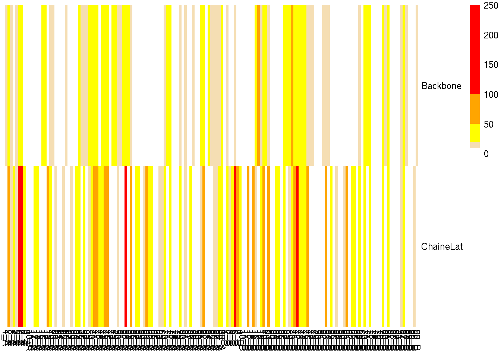
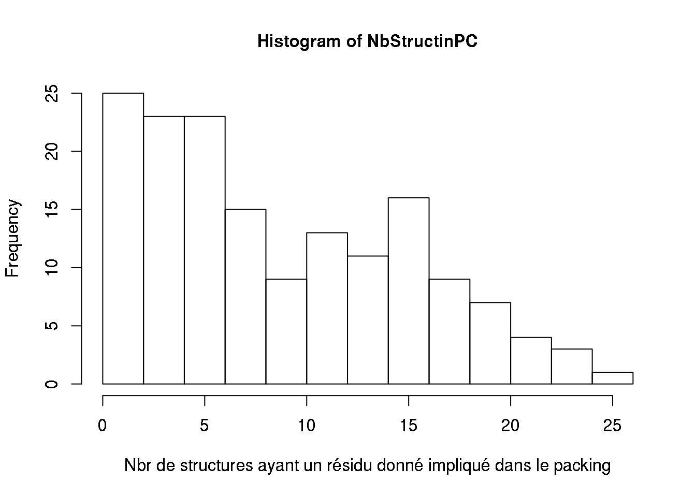
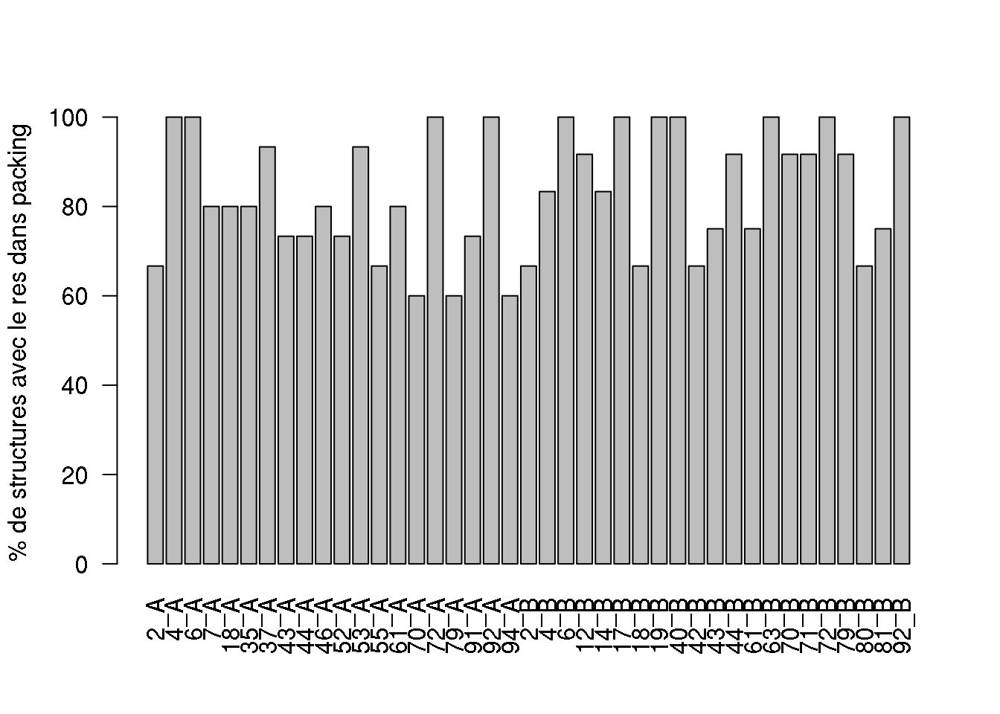

# Objectif

* Travail 1 :

1. Etudier la conservation du packing cristallin dans les 13 structures de PR2 et les 15 structures de PR1
2. Mettre en relation cette conservation avec les RMSD
3. Lien entre conservation de l’asymétrie et neqSL ?

* Travail 2 : Comparaison des interfaces PR1 et PR2
* Travail 3 : Etude de la variabilité structurale de PR1 et PR2 – SA-conf
* Travail 4 : Etude de la flexibilité de PR1 et PR2 – distance au SL


# Semaine 1 : Vendredi 18/01/2018

## Objectifs 
Etudier la conservation du packing cristallin dans les 11 structures de PR2 et les 15 structures de PR1.
Pour cela, on va identifier les résidus qui sont : 

* inclus dans le packing cristallin chez toutes (ou la majorité (=80%)) des structures
* inclus dans le packing cristallin chez toutes (ou la majorité (=80%)) des structures de PR1
* inclus dans le packing cristallin chez toutes (ou la majorité (=80%)) des structures de PR2


## Données

* 26 fichiers qui contient les atomes impliqués dans le packing cristallin pour chaque structure de PR1 et PR2
* le type de PR pour chaque code PDB


PDB code | type | remarque
---------|------|---------
3s45 | PR2 |
1hhp | PR1 |
1hih | PR1 |
1hii | PR2 |
1hiv | PR1 |
1hpv | PR1 |
1hsh | PR2 |
1hsi | PR2 | 
1ivp | PR2 |
1sdt | PR1 | (peu avoir des pbl de numérotation des résidus)
2hb3 | PR1 |
2hb4 | PR1 | (monomère)
2hpe | PR2 |
2hpf | PR2 |
2ien | PR1 |  (peu avoir des pbl de numérotation des résidus)
2mip | PR2 |
2nph | PR1 |  (peu avoir des pbl de numérotation des résidus)
3phv | PR1 | (monomère)
2z4o | PR1 |  (peu avoir des pbl de numérotation des résidus)
3ebz | PR2 |  (peu avoir des pbl de numérotation des résidus)
3ec0 | PR2 |  (peu avoir des pbl de numérotation des résidus)
3ecg | PR2 | (peu avoir des pbl de numérotation des résidus)
3ekv | PR1 |
3nu3 | PR1 |  (peu avoir des pbl de numérotation des résidus)
4hla | PR1 |
4ll3 | PR1 |
1hsh | PR2 | 

## To do

### Création d'une matrice sous R qui contient en lignes les protéines et en colonnes les positions

La case de la matrice contient : 

* 1 quand le résidu a au moins 1 atomes impliqués dans le packing dans la structure, 
* 0 sinon.


Attention, 

* certaines structures sont des monomères 
* certaines structures ont des mauvaises numérotations des résidus. Normalement les résidus sont numérotés de 1 à 99 pour la chaîne A et la chaîne B. Certaines structures ont les résidus de la chaîne B numérotés de 101 à 109.
Ainsi le résidus 101B = 1B


1. Etape 1 : récupération de la liste des fichiers PDB

```r
listFile = dir("fileByProt3/")
```

2. Exemple sur le premier fichier


```r
filein = listFile[1]
M = read.table(paste("fileByProt3",filein,sep="/"))
listAtom = unique(paste(as.character(M[,6]), as.character(M[,5]), sep="_"))
listAtomSyn = listAtom
listAtomSyn
```

```
 [1] "1_A"  "2_A"  "3_A"  "4_A"  "5_A"  "6_A"  "7_A"  "8_A"  "9_A"  "23_A" "24_A" "25_A" "26_A" "27_A" "29_A" "35_A" "37_A" "42_A" "48_A" "49_A" "50_A" "51_A" "52_A" "53_A" "54_A" "55_A" "56_A" "57_A" "61_A" "67_A" "69_A" "72_A" "79_A" "87_A" "90_A" "91_A" "92_A" "93_A" "94_A" "95_A" "96_A" "97_A"
[43] "98_A" "99_A"
```


Récupération de la liste des résidus pour chaque protéine


```r
NbProt =(1:26)
NbResidues =(1:159)

for (i in NbProt){
  filein = listFile[i]
  M = read.table(paste("fileByProt3",filein,sep="/"))
  listAtom = unique(paste(as.character(M[,6]), as.character(M[,5]), sep="_"))
  listAtomSyn = unique(c(listAtom,listAtomSyn))
}

listAtomSyn
```

```
  [1] "2_A"  "4_A"  "6_A"  "7_A"  "8_A"  "12_A" "14_A" "16_A" "17_A" "18_A" "19_A" "20_A" "21_A" "35_A" "37_A" "38_A" "39_A" "40_A" "43_A" "44_A" "45_A" "46_A" "47_A" "48_A" "51_A" "52_A" "53_A" "60_A" "61_A" "63_A" "70_A" "71_A" "72_A" "79_A" "81_A" "92_A" "94_A" "96_A" "2_B"  "4_B"  "6_B"  "7_B" 
 [43] "8_B"  "12_B" "14_B" "16_B" "17_B" "18_B" "19_B" "20_B" "21_B" "37_B" "38_B" "39_B" "40_B" "44_B" "46_B" "47_B" "48_B" "52_B" "53_B" "61_B" "63_B" "70_B" "71_B" "72_B" "79_B" "92_B" "96_B" "41_A" "35_B" "43_B" "51_B" "57_B" "42_A" "54_A" "55_A" "57_A" "58_A" "65_A" "98_A" "99_A" "10_B" "41_B"
 [85] "42_B" "45_B" "55_B" "81_B" "94_B" "98_B" "99_B" "1_A"  "3_A"  "5_A"  "9_A"  "24_A" "25_A" "26_A" "27_A" "29_A" "49_A" "50_A" "56_A" "67_A" "69_A" "87_A" "90_A" "91_A" "93_A" "95_A" "97_A" "34_A" "36_A" "73_A" "88_A" "89_A" "34_B" "65_B" "68_B" "80_B" "91_B" "15_A" "68_A" "80_A" "36_B" "49_B"
[127] "58_B" "62_B" "78_B" "1_B"  "54_B" "95_B" "60_B" "11_B" "82_B" "3_B"  "30_A" "82_A" "29_B" "30_B" "76_B" "13_B" "74_B" "83_B" "87_B" "88_B" "59_A" "74_A" "50_B" "56_B" "59_B" "23_A" "66_A" "11_A" "69_B" "73_B" "67_B" "10_A" "78_A"
```


```r
Proteases = c("1hhp","1hih","1hii","1hiv","1hpv","1hsh","1hsi","1ivp","1sdt","2hb3","2hb4","2hpe","2hpf","2ien","2mip","2nph","2z4o","3ebz","3ec0","3ecg","3ekv","3nu3","3phv","3s45","4hla","4ll3")

type = c("PR1","PR1","PR2","PR1","PR1","PR2","PR2","PR2","PR1","PR1","PR1","PR2","PR2","PR1","PR2","PR1","PR1","PR2","PR2","PR2","PR1","PR1","PR1","PR2","PR1","PR1")

names(type) =c("1hhp","1hih","1hii","1hiv","1hpv","1hsh","1hsi","1ivp","1sdt","2hb3","2hb4","2hpe","2hpf","2ien","2mip","2nph","2z4o","3ebz","3ec0","3ecg","3ekv","3nu3","3phv","3s45","4hla","4ll3")

matrice <- matrix(0, nrow=length(Proteases), ncol=length(listAtomSyn))

rownames(matrice) <- Proteases
colnames(matrice) <- listAtomSyn

for (i in 1:length(NbProt)) {
  filein = listFile[i]
  M = read.table(paste("fileByProt3",filein,sep="/"))
  Atome <- unique(c(paste(as.character(M[,6]), as.character(M[,5]), sep="_")))
  for (j in 1:length(NbResidues)) {
    for (y in 1:length(Atome)) {
      if ((listAtomSyn[j]) == (Atome[y])){
        matrice[i,j] = 1
      }
    }
  }
}

residue = colnames(matrice)
resA = residue[grep("_A", residue)]
resA_ssA = as.numeric(gsub("_A","", resA))
names(resA_ssA) = resA

sort.resA = names(sort(resA_ssA))

resB = residue[grep("_B", residue)]
resB_ssB = as.numeric(gsub("_B","", resB))
names(resB_ssB) = resB

sort.resB = names(sort(resB_ssB))

sort.res = c(sort.resA, sort.resB)
matrice.sort = matrice[,sort.res]

matrice  = matrice.sort
matrice
```

```
     1_A 2_A 3_A 4_A 5_A 6_A 7_A 8_A 9_A 10_A 11_A 12_A 14_A 15_A 16_A 17_A 18_A 19_A 20_A 21_A 23_A 24_A 25_A 26_A 27_A 29_A 30_A 34_A 35_A 36_A 37_A 38_A 39_A 40_A 41_A 42_A 43_A 44_A 45_A 46_A 47_A 48_A 49_A 50_A 51_A 52_A 53_A 54_A 55_A 56_A 57_A 58_A 59_A 60_A 61_A 63_A 65_A 66_A 67_A 68_A
1hhp   1   1   1   1   1   1   1   1   1    0    0    0    0    0    0    0    0    0    0    0    1    1    1    1    1    1    0    0    1    0    1    0    0    0    0    1    0    0    0    0    0    1    1    1    1    1    1    1    1    1    1    0    0    0    1    0    0    0    1    0
1hih   0   1   0   1   0   1   0   0   0    0    0    1    1    0    1    0    1    1    0    0    0    0    0    0    0    0    0    1    0    0    1    1    1    1    0    1    1    1    0    1    0    0    0    0    0    0    1    0    1    0    0    0    0    0    1    1    0    0    1    1
1hii   1   1   1   1   0   1   1   0   0    0    1    0    1    0    1    1    1    1    0    0    0    0    0    0    0    0    0    0    0    0    0    0    1    1    1    1    1    0    1    1    0    0    0    0    0    0    1    0    1    0    0    0    0    1    1    0    0    0    1    1
1hiv   0   1   0   1   0   1   0   0   0    1    1    1    1    0    1    0    1    1    0    1    0    0    0    0    0    0    0    1    0    1    1    1    1    0    1    1    0    1    1    1    0    0    0    0    0    1    1    0    1    0    0    0    0    0    1    1    0    0    0    1
1hpv   0   1   0   1   0   1   1   0   0    0    0    1    1    0    1    1    1    1    1    1    0    0    0    0    0    0    0    0    1    0    1    1    1    1    0    0    1    0    0    1    0    0    0    0    0    1    1    0    1    0    0    0    0    0    1    1    0    0    0    0
1hsh   0   1   0   0   0   1   1   1   0    1    0    1    0    0    1    1    0    0    0    0    0    0    0    0    0    1    0    1    1    0    1    0    0    1    1    1    1    1    1    1    0    0    0    0    1    0    0    0    1    0    1    0    0    1    1    1    0    0    0    1
1hsi   0   1   0   1   0   1   1   0   0    0    0    0    0    0    1    1    1    0    0    0    0    0    0    0    0    0    0    0    0    0    0    0    1    1    1    0    0    0    0    1    0    0    0    0    0    0    1    0    0    0    0    0    0    0    0    1    0    0    0    1
1ivp   0   1   0   1   0   1   1   0   0    0    1    1    1    0    0    0    0    1    1    0    0    0    0    0    0    0    0    0    0    0    1    0    1    0    1    1    0    1    1    1    0    0    0    0    0    0    1    0    1    0    0    0    1    1    0    0    1    0    0    1
1sdt   0   0   0   1   0   1   1   0   0    0    0    0    0    0    0    0    1    0    0    0    0    0    0    0    0    0    0    1    1    1    1    0    0    0    0    0    1    1    1    1    0    0    0    0    0    0    1    0    0    0    1    1    0    0    0    0    0    0    0    0
2hb3   0   0   0   1   0   1   1   0   0    0    0    0    0    0    0    0    1    0    1    0    0    0    0    0    0    0    0    1    1    1    1    0    0    0    1    0    1    1    1    1    0    1    1    0    0    0    1    0    1    0    0    1    0    0    1    0    0    0    0    0
2hb4   1   1   1   1   1   1   1   1   1    0    0    0    0    0    0    0    0    0    0    0    1    1    1    1    1    1    0    0    1    0    0    0    0    0    0    1    0    0    0    0    0    1    1    1    1    1    1    1    1    1    1    0    0    0    1    0    0    1    1    0
2hpe   1   1   0   1   0   1   1   0   0    0    0    0    0    0    0    0    0    1    0    0    0    0    0    0    0    0    0    0    1    0    1    0    1    1    1    1    0    1    0    0    0    0    0    0    1    1    0    0    1    0    1    1    1    1    1    0    0    0    0    1
2hpf   0   0   0   0   1   1   1   0   0    0    0    0    0    0    0    0    0    0    0    0    0    0    0    0    0    0    0    0    0    0    0    0    0    0    0    0    0    0    0    1    0    0    0    0    0    1    1    0    1    0    0    0    0    0    1    1    0    0    0    0
2ien   0   0   0   1   0   1   1   0   0    0    0    0    0    0    0    0    1    0    1    0    0    0    0    0    0    0    0    1    1    1    1    0    0    0    1    0    1    1    1    1    0    0    1    1    0    1    1    0    1    0    1    1    0    0    1    0    0    0    0    0
2mip   0   0   0   1   0   1   1   1   0    0    0    0    1    0    1    1    0    1    0    0    0    0    0    0    0    1    1    0    0    0    0    0    0    1    1    1    0    1    1    1    1    0    0    0    1    0    1    1    1    0    1    1    0    1    0    0    0    0    0    0
2nph   0   1   1   1   0   1   1   0   0    0    0    1    1    0    1    1    1    1    1    1    0    0    0    0    0    0    0    0    1    0    1    1    1    1    0    0    1    1    0    1    1    1    1    0    0    1    1    0    0    0    0    0    0    0    1    1    0    0    1    0
2z4o   0   0   0   1   0   1   1   0   0    0    0    0    0    0    0    0    1    0    1    0    0    0    0    0    0    0    0    1    1    1    1    0    0    0    0    0    1    1    1    1    0    0    1    1    0    1    1    0    0    0    1    1    0    0    0    0    0    0    0    0
3ebz   0   1   0   1   0   1   1   0   0    0    0    0    0    0    0    0    0    0    0    0    0    0    0    0    0    0    0    0    0    0    0    0    0    1    1    1    1    1    1    1    0    1    0    0    0    0    1    1    1    0    1    1    0    0    0    1    1    0    0    0
3ec0   0   1   0   1   0   1   1   0   0    0    0    0    0    0    0    0    0    0    0    0    0    0    0    0    0    0    0    0    0    0    1    0    0    1    1    1    1    1    1    1    0    1    0    0    0    0    1    1    1    0    0    1    0    0    0    1    1    0    0    0
3ecg   0   1   0   1   0   1   1   0   0    0    0    0    0    0    0    0    1    0    0    0    0    0    0    0    0    0    0    0    0    0    0    0    0    1    1    1    1    1    1    1    0    1    0    0    0    0    1    1    1    0    0    1    0    0    0    1    1    0    0    0
3ekv   0   1   0   1   0   1   0   0   0    0    0    1    1    1    1    1    1    1    0    0    0    0    0    0    0    0    0    1    0    1    1    1    1    1    0    1    1    1    0    1    0    0    0    0    0    1    1    0    1    0    0    0    0    0    1    1    1    0    1    1
3nu3   0   0   0   1   0   1   1   0   0    0    0    0    0    0    0    0    1    0    1    0    0    0    0    0    0    0    0    1    1    1    1    0    0    0    0    0    1    1    1    1    0    1    1    0    0    0    1    0    1    0    1    1    0    0    0    0    0    0    0    0
3phv   1   1   1   1   1   1   1   1   1    0    0    0    0    0    0    0    0    0    0    0    0    1    1    1    1    1    0    0    1    0    1    0    0    0    0    1    0    0    0    0    0    1    1    1    1    1    0    1    1    1    1    0    0    0    1    0    0    0    1    0
3s45   0   1   0   1   0   1   1   0   0    0    0    0    0    0    0    0    0    0    0    0    0    0    0    0    0    0    0    0    0    0    0    0    0    1    1    1    1    1    1    1    0    1    0    0    0    0    1    1    1    0    1    1    0    0    0    0    1    0    0    0
4hla   0   1   0   1   0   1   1   0   0    0    0    1    1    0    1    1    1    1    1    1    0    0    0    0    0    0    0    0    1    0    1    1    1    1    1    0    1    1    0    1    0    0    0    0    1    1    1    0    0    0    0    0    0    0    1    1    0    0    0    0
4ll3   0   1   0   1   0   1   1   1   0    0    0    1    1    0    1    1    1    1    1    1    0    0    0    0    0    0    0    0    1    0    1    1    1    1    0    0    1    1    1    1    1    1    0    0    1    1    1    0    0    0    0    0    0    1    1    1    0    0    0    0
     69_A 70_A 71_A 72_A 73_A 74_A 78_A 79_A 80_A 81_A 82_A 87_A 88_A 89_A 90_A 91_A 92_A 93_A 94_A 95_A 96_A 97_A 98_A 99_A 1_B 2_B 3_B 4_B 6_B 7_B 8_B 10_B 11_B 12_B 13_B 14_B 16_B 17_B 18_B 19_B 20_B 21_B 29_B 30_B 34_B 35_B 36_B 37_B 38_B 39_B 40_B 41_B 42_B 43_B 44_B 45_B 46_B 47_B 48_B 49_B
1hhp    1    0    0    1    0    0    0    1    0    0    0    1    0    0    1    1    1    1    1    1    1    1    1    1   0   0   0   0   0   0   0    0    0    0    0    0    0    0    0    0    0    0    0    0    0    0    0    0    0    0    0    0    0    0    0    0    0    0    0    0
1hih    0    1    0    1    0    0    0    1    1    1    1    0    0    0    0    1    1    0    0    0    0    0    0    0   0   0   0   1   1   1   0    0    0    1    0    1    1    1    1    1    1    0    0    0    0    1    1    1    1    1    1    1    1    1    1    1    1    0    0    1
1hii    0    1    0    0    0    0    0    0    0    0    0    0    0    0    0    1    1    1    1    0    0    0    0    0   1   1   1   1   1   1   0    0    0    0    0    0    0    0    0    0    0    0    0    0    0    0    0    1    1    1    1    1    1    1    1    1    1    0    0    0
1hiv    0    1    1    1    0    0    0    1    1    1    1    0    0    0    0    1    1    0    0    0    0    0    0    0   0   0   0   1   1   1   0    0    0    1    0    0    1    1    1    1    1    1    0    0    0    1    0    1    1    1    1    1    1    0    1    1    1    0    0    1
1hpv    0    1    1    1    0    0    0    0    0    0    0    0    0    0    0    0    1    0    0    0    0    0    0    0   0   1   0   1   1   1   0    0    0    1    0    1    1    1    1    1    1    1    0    0    0    1    0    1    1    1    1    0    0    1    0    0    1    1    1    0
1hsh    0    0    0    1    0    0    1    1    0    1    1    1    0    0    0    0    0    0    0    0    0    0    0    1   0   0   0   0   1   1   1    0    0    0    0    0    1    1    1    1    0    0    1    1    0    0    0    0    1    1    0    0    1    0    1    1    1    0    0    0
1hsi    0    0    0    1    0    0    0    0    0    0    0    0    0    0    0    0    0    0    0    0    0    0    0    0   1   1   1   0   0   1   1    0    0    1    0    0    1    1    1    1    0    1    0    0    0    0    0    1    1    1    0    0    0    0    1    1    1    0    0    0
1ivp    1    0    0    0    0    1    0    1    1    1    0    0    0    0    0    1    1    1    1    0    0    0    0    0   0   0   0   0   1   1   0    0    0    0    0    1    0    1    0    1    0    0    0    0    0    0    0    0    0    1    1    0    1    0    1    0    0    0    0    0
1sdt    0    0    0    1    1    0    0    0    0    0    0    0    1    1    0    1    1    0    1    0    0    0    0    0   0   1   0   0   1   0   0    0    0    1    0    1    0    1    0    1    0    0    0    0    1    0    0    0    0    0    1    1    1    1    1    0    0    0    0    0
2hb3    0    1    0    1    1    0    0    0    0    0    0    0    1    1    0    1    1    0    1    0    0    0    0    0   0   1   0   0   1   0   0    0    0    1    0    1    0    1    1    1    0    0    0    0    1    0    0    0    0    0    1    1    1    1    1    0    0    0    0    0
2hb4    1    0    0    1    0    0    0    1    0    1    0    1    0    0    1    1    1    1    1    1    1    1    1    1   0   0   0   0   0   0   0    0    0    0    0    0    0    0    0    0    0    0    0    0    0    0    0    0    0    0    0    0    0    0    0    0    0    0    0    0
2hpe    1    0    0    0    0    1    0    1    0    1    0    0    0    0    0    0    0    0    0    0    0    0    1    1   0   1   0   0   1   1   0    0    0    1    0    0    0    1    1    1    1    1    0    0    0    0    0    1    0    1    1    1    1    1    0    0    1    0    0    0
2hpf    0    0    1    1    0    0    0    0    0    0    0    0    0    0    0    0    0    0    0    0    0    0    0    0   0   0   0   0   1   1   0    0    0    1    1    1    1    1    0    1    1    1    0    0    0    0    0    1    0    1    0    0    0    0    0    1    1    0    0    0
2ien    0    1    0    1    1    0    0    0    0    0    0    0    1    1    0    1    1    0    1    0    0    0    0    0   0   0   0   1   1   0   0    0    0    1    0    1    0    1    0    1    0    0    0    0    1    0    0    0    0    0    1    1    1    1    1    0    0    0    0    0
2mip    0    0    0    1    0    0    0    0    0    1    1    1    0    0    0    0    0    0    0    0    0    0    0    1   1   1   1   0   1   1   1    0    0    1    0    1    1    1    1    1    0    1    1    1    0    0    0    1    0    0    1    1    1    1    1    0    1    1    1    0
2nph    0    1    1    1    0    0    0    1    0    0    0    0    0    0    0    0    1    0    0    0    0    0    0    0   0   1   1   1   1   1   0    0    0    1    0    1    1    1    1    1    1    1    0    0    0    1    0    1    1    1    1    0    0    1    1    0    1    0    0    0
2z4o    0    0    0    1    1    0    0    0    0    0    0    0    1    1    0    1    1    0    1    0    0    0    0    0   0   1   0   1   1   0   0    0    0    1    0    1    0    1    0    1    0    0    0    0    1    0    0    0    0    0    1    1    1    1    1    0    0    0    0    0
3ebz    0    1    0    1    0    0    0    1    0    0    0    0    0    0    0    0    0    0    0    0    1    0    1    1   1   1   0   0   0   1   0    1    1    1    0    1    0    1    1    1    1    1    0    0    0    0    0    1    0    0    1    1    1    1    1    1    1    0    1    0
3ec0    1    1    0    1    0    0    0    1    0    0    0    0    0    0    0    0    0    0    0    0    1    0    1    1   1   1   0   0   0   1   0    1    0    1    0    1    0    1    1    1    1    1    0    0    0    0    0    1    0    0    1    1    1    1    1    1    1    0    0    0
3ecg    0    1    0    0    0    0    0    1    0    0    0    0    0    0    0    0    0    0    0    0    1    0    1    1   1   1   0   0   0   1   0    1    0    1    0    1    0    1    1    1    1    1    0    0    0    0    0    1    0    0    1    1    1    1    1    1    1    0    1    0
3ekv    0    1    1    1    0    0    0    1    1    1    0    0    0    0    0    1    1    0    0    0    0    0    0    0   0   0   0   1   1   1   0    0    0    0    0    0    1    1    1    1    0    0    0    0    0    1    1    1    1    1    1    0    1    0    1    1    1    0    1    1
3nu3    0    0    0    1    1    0    0    0    0    0    0    0    1    1    0    1    1    0    1    0    0    0    0    0   0   1   0   1   1   0   0    0    0    1    0    1    0    1    0    1    0    0    0    0    1    0    0    0    0    0    1    1    1    1    1    0    0    0    0    0
3phv    1    0    0    1    0    0    0    1    0    0    0    1    0    0    1    1    1    1    1    1    1    1    1    1   0   0   0   0   0   0   0    0    0    0    0    0    0    0    0    0    0    0    0    0    0    0    0    0    0    0    0    0    0    0    0    0    0    0    0    0
3s45    0    1    0    0    0    0    0    1    0    0    0    0    0    0    0    0    0    0    0    0    0    0    1    1   0   1   0   0   0   1   0    1    0    1    0    1    0    1    1    1    1    1    0    0    0    0    0    1    0    0    1    1    1    1    1    1    1    0    1    0
4hla    0    1    1    1    0    0    0    1    0    0    0    0    0    0    0    0    1    0    0    0    0    0    0    0   0   1   0   1   1   1   0    0    0    1    0    1    1    1    1    1    1    1    0    0    0    1    0    1    1    1    1    0    0    1    1    0    1    1    1    0
4ll3    0    1    1    1    0    0    0    1    0    1    0    0    0    0    0    0    1    0    1    0    1    0    0    0   0   1   0   1   1   1   1    0    0    1    0    1    1    1    1    1    1    1    0    0    0    0    0    1    1    1    1    0    0    0    1    0    1    1    1    0
     50_B 51_B 52_B 53_B 54_B 55_B 56_B 57_B 58_B 59_B 60_B 61_B 62_B 63_B 65_B 67_B 68_B 69_B 70_B 71_B 72_B 73_B 74_B 76_B 78_B 79_B 80_B 81_B 82_B 83_B 87_B 88_B 91_B 92_B 94_B 95_B 96_B 98_B 99_B
1hhp    0    0    0    0    0    0    0    0    0    0    0    0    0    0    0    0    0    0    0    0    0    0    0    0    0    0    0    0    0    0    0    0    0    0    0    0    0    0    0
1hih    1    0    1    1    0    1    0    1    1    0    0    0    0    1    0    0    0    0    1    1    1    0    0    0    0    1    1    1    0    0    0    0    0    1    1    0    1    0    0
1hii    0    0    0    1    0    0    0    1    0    1    1    1    0    0    0    1    1    0    0    0    1    0    0    0    0    1    0    1    0    0    0    0    0    0    0    0    0    0    1
1hiv    0    0    1    1    0    0    0    1    0    0    0    0    0    1    0    0    0    0    1    0    1    0    0    0    0    1    1    1    0    0    0    0    0    1    1    0    1    0    0
1hpv    0    0    1    1    0    0    0    0    0    0    0    1    0    1    0    0    0    0    1    1    1    0    0    0    0    0    0    0    0    0    0    0    0    1    0    0    0    0    0
1hsh    0    1    1    1    1    1    0    1    0    0    0    1    0    1    1    0    1    1    1    0    0    0    0    0    0    1    0    0    0    0    1    0    0    0    0    0    0    0    0
1hsi    0    0    0    1    0    1    0    0    0    0    0    0    0    1    0    1    1    0    0    0    0    0    0    0    0    0    0    1    0    0    0    0    0    0    0    0    0    0    0
1ivp    0    0    0    1    0    0    0    1    1    1    1    1    0    0    0    0    1    1    0    0    1    1    1    0    0    1    0    1    0    0    0    0    0    0    0    0    0    0    0
1sdt    0    0    0    0    0    1    0    0    0    0    0    1    0    1    1    0    1    0    0    1    1    0    0    0    0    1    1    1    0    0    0    0    1    1    0    0    0    0    0
2hb3    0    0    0    0    0    1    0    0    0    0    0    1    0    1    1    0    1    0    1    1    1    0    0    0    0    1    1    1    1    0    0    0    1    1    0    0    0    0    0
2hb4    0    0    0    0    0    0    0    0    0    0    0    0    0    0    0    0    0    0    0    0    0    0    0    0    0    0    0    0    0    0    0    0    0    0    0    0    0    0    0
2hpe    1    1    1    1    0    1    1    1    0    1    1    1    0    0    0    0    1    0    0    0    1    0    1    0    0    0    0    0    1    1    0    0    0    0    1    1    1    1    0
2hpf    0    0    0    1    1    1    0    0    0    0    1    0    0    0    0    0    0    0    0    0    0    0    1    0    0    0    0    0    0    1    1    1    1    1    0    0    0    0    0
2ien    0    0    0    0    0    1    0    0    0    0    0    1    0    1    1    0    1    0    1    1    1    0    0    0    0    1    1    1    1    0    0    0    1    1    0    0    0    0    0
2mip    0    1    1    1    1    1    0    0    0    0    0    1    0    1    1    0    1    0    1    0    1    0    0    1    0    1    0    0    0    0    0    0    0    0    0    0    0    0    0
2nph    0    0    1    1    0    0    0    1    0    0    0    1    0    1    0    0    1    0    1    1    1    0    0    0    0    1    0    1    1    0    0    0    0    1    0    0    0    0    0
2z4o    0    0    0    0    0    1    0    0    0    0    0    1    0    1    1    0    1    0    1    1    1    0    0    0    0    1    1    1    1    0    0    0    1    1    0    0    0    0    0
3ebz    0    0    0    1    1    1    0    1    0    0    1    1    0    0    0    0    1    0    0    0    0    0    0    0    0    1    0    1    0    0    0    0    0    0    1    0    1    1    1
3ec0    0    0    0    1    1    1    0    0    0    0    1    1    0    1    0    0    1    0    1    0    0    0    0    0    0    1    0    1    0    0    0    0    0    0    1    0    1    1    1
3ecg    0    0    0    1    1    1    0    0    0    0    0    0    0    0    0    0    0    0    1    0    0    0    0    0    0    1    0    1    0    0    0    0    0    0    1    1    1    1    1
3ekv    0    0    1    1    0    0    0    1    1    0    0    0    1    1    0    0    0    0    1    1    1    0    0    0    1    1    1    1    0    0    0    0    0    1    0    0    1    0    0
3nu3    0    0    0    0    0    1    0    0    0    0    0    1    0    1    1    0    1    0    1    1    1    0    0    0    0    1    1    1    0    0    0    0    1    1    0    0    0    0    0
3phv    0    0    0    0    0    0    0    0    0    0    0    0    0    0    0    0    0    0    0    0    0    0    0    0    0    0    0    0    0    0    0    0    0    0    0    0    0    0    0
3s45    0    0    0    1    0    1    0    1    0    0    0    0    0    0    0    0    0    0    0    0    0    0    0    0    0    1    0    1    0    0    0    0    0    0    1    0    0    1    1
4hla    0    1    1    1    0    0    0    1    0    0    0    1    0    1    0    0    0    0    1    1    1    0    0    0    0    1    0    0    0    0    0    0    0    1    0    0    0    0    0
4ll3    0    0    1    1    0    0    0    0    0    0    0    1    0    1    0    0    0    0    1    1    1    0    0    0    0    1    0    0    0    0    0    0    0    1    0    0    1    0    0
```


### Coloration de la matrice
Utilisation la commande `pheatmap` du package `pheatmap`


```r
library(pheatmap)
?pheatmap
pheatmap::pheatmap(matrice)
```


```r
pheatmap(matrice[-27:-29,], cluster_rows = TRUE, cluster_cols = FALSE, br=-1:1, col=c("white", "red"))
```


### Calculer le nombre de structure dans lequel un résidu est impliqué dans le packing cristallin 
Le  nombre de structure dans lequel un résidu est impliqué dans le packing cristallin = la somme des colonnes de la matrice

1. Calculer le nombre de structure dans lequel un résidu est impliqué dans le packing cristallin


```r
StructinPC = c("NbStructinPC","NbStructinPC.PR1","NbStructinPC.PR2")

matriceStruct <- matrix(0, nrow=length(StructinPC), ncol=length(listAtomSyn))

rownames(matriceStruct) <- StructinPC
colnames(matriceStruct) <- sort.res


for (i in 1:length(NbResidues)){
  y = 0
  for (j in 1:length(Proteases[1:26])) {
    if (matrice[j,i] == 1){
        y = y+1
        matriceStruct[1,i] = y
    }
  }
}
matriceStruct
```

```
                 1_A 2_A 3_A 4_A 5_A 6_A 7_A 8_A 9_A 10_A 11_A 12_A 14_A 15_A 16_A 17_A 18_A 19_A 20_A 21_A 23_A 24_A 25_A 26_A 27_A 29_A 30_A 34_A 35_A 36_A 37_A 38_A 39_A 40_A 41_A 42_A 43_A 44_A 45_A 46_A 47_A 48_A 49_A 50_A 51_A 52_A 53_A 54_A 55_A 56_A 57_A 58_A 59_A 60_A 61_A 63_A 65_A 66_A
NbStructinPC       5  19   5  24   4  26  23   6   3    2    3    9   10    1   11    9   15   11    9    5    2    3    3    3    3    5    1    9   14    7   18    7   11   15   14   15   17   19   15   22    3   11    8    5    8   13   23    8   20    3   12   11    2    6   16   13    6    1
NbStructinPC.PR1   0   0   0   0   0   0   0   0   0    0    0    0    0    0    0    0    0    0    0    0    0    0    0    0    0    0    0    0    0    0    0    0    0    0    0    0    0    0    0    0    0    0    0    0    0    0    0    0    0    0    0    0    0    0    0    0    0    0
NbStructinPC.PR2   0   0   0   0   0   0   0   0   0    0    0    0    0    0    0    0    0    0    0    0    0    0    0    0    0    0    0    0    0    0    0    0    0    0    0    0    0    0    0    0    0    0    0    0    0    0    0    0    0    0    0    0    0    0    0    0    0    0
                 67_A 68_A 69_A 70_A 71_A 72_A 73_A 74_A 78_A 79_A 80_A 81_A 82_A 87_A 88_A 89_A 90_A 91_A 92_A 93_A 94_A 95_A 96_A 97_A 98_A 99_A 1_B 2_B 3_B 4_B 6_B 7_B 8_B 10_B 11_B 12_B 13_B 14_B 16_B 17_B 18_B 19_B 20_B 21_B 29_B 30_B 34_B 35_B 36_B 37_B 38_B 39_B 40_B 41_B 42_B 43_B 44_B 45_B
NbStructinPC        7    8    6   14    7   21    5    2    1   16    4    9    4    5    5    5    3   13   17    5   11    3    7    3    8   10   6  16   4  11  18  18   4    4    1   19    1   17   11   22   16   22   12   13    2    2    5    6    2   16   10   13   20   14   17   16   20   11
NbStructinPC.PR1    0    0    0    0    0    0    0    0    0    0    0    0    0    0    0    0    0    0    0    0    0    0    0    0    0    0   0   0   0   0   0   0   0    0    0    0    0    0    0    0    0    0    0    0    0    0    0    0    0    0    0    0    0    0    0    0    0    0
NbStructinPC.PR2    0    0    0    0    0    0    0    0    0    0    0    0    0    0    0    0    0    0    0    0    0    0    0    0    0    0   0   0   0   0   0   0   0    0    0    0    0    0    0    0    0    0    0    0    0    0    0    0    0    0    0    0    0    0    0    0    0    0
                 46_B 47_B 48_B 49_B 50_B 51_B 52_B 53_B 54_B 55_B 56_B 57_B 58_B 59_B 60_B 61_B 62_B 63_B 65_B 67_B 68_B 69_B 70_B 71_B 72_B 73_B 74_B 76_B 78_B 79_B 80_B 81_B 82_B 83_B 87_B 88_B 91_B 92_B 94_B 95_B 96_B 98_B 99_B
NbStructinPC       17    4    8    3    2    4   10   18    6   15    1   11    3    3    6   16    1   16    7    2   14    2   15   11   16    1    3    1    1   19    8   16    5    2    2    1    6   13    7    2    8    5    5
NbStructinPC.PR1    0    0    0    0    0    0    0    0    0    0    0    0    0    0    0    0    0    0    0    0    0    0    0    0    0    0    0    0    0    0    0    0    0    0    0    0    0    0    0    0    0    0    0
NbStructinPC.PR2    0    0    0    0    0    0    0    0    0    0    0    0    0    0    0    0    0    0    0    0    0    0    0    0    0    0    0    0    0    0    0    0    0    0    0    0    0    0    0    0    0    0    0
```

```r
type = matrice[,ncol(matrice)]
names(type)
```

```
 [1] "1hhp" "1hih" "1hii" "1hiv" "1hpv" "1hsh" "1hsi" "1ivp" "1sdt" "2hb3" "2hb4" "2hpe" "2hpf" "2ien" "2mip" "2nph" "2z4o" "3ebz" "3ec0" "3ecg" "3ekv" "3nu3" "3phv" "3s45" "4hla" "4ll3"
```

```r
#matrice[names(which(type=="PR2")),]
```


```r
matrice2 = matrice[,-ncol(matrice)]
```


```r
NbStructinPC = apply(matrice[1:26,],2,sum)
sort(NbStructinPC)
```

```
15_A 30_A 66_A 78_A 11_B 13_B 56_B 62_B 73_B 76_B 78_B 88_B 10_A 23_A 59_A 74_A 29_B 30_B 36_B 50_B 67_B 69_B 83_B 87_B 95_B  9_A 11_A 24_A 25_A 26_A 27_A 47_A 56_A 90_A 95_A 97_A 49_B 58_B 59_B 74_B  5_A 80_A 82_A  3_B  8_B 10_B 47_B 51_B  1_A  3_A 21_A 29_A 50_A 73_A 87_A 88_A 89_A 93_A 34_B 82_B 
   1    1    1    1    1    1    1    1    1    1    1    1    2    2    2    2    2    2    2    2    2    2    2    2    2    3    3    3    3    3    3    3    3    3    3    3    3    3    3    3    4    4    4    4    4    4    4    4    5    5    5    5    5    5    5    5    5    5    5    5 
98_B 99_B  8_A 60_A 65_A 69_A  1_B 35_B 54_B 60_B 91_B 36_A 38_A 67_A 71_A 96_A 65_B 94_B 49_A 51_A 54_A 68_A 98_A 48_B 80_B 96_B 12_A 17_A 20_A 34_A 81_A 14_A 99_A 38_B 52_B 16_A 19_A 39_A 48_A 58_A 94_A  4_B 16_B 45_B 57_B 71_B 57_A 20_B 52_A 63_A 91_A 21_B 39_B 92_B 35_A 41_A 70_A 41_B 68_B 18_A 
   5    5    6    6    6    6    6    6    6    6    6    7    7    7    7    7    7    7    8    8    8    8    8    8    8    8    9    9    9    9    9   10   10   10   10   11   11   11   11   11   11   11   11   11   11   11   12   12   13   13   13   13   13   13   14   14   14   14   14   15 
40_A 42_A 45_A 55_B 70_B 61_A 79_A  2_B 18_B 37_B 43_B 61_B 63_B 72_B 81_B 43_A 92_A 14_B 42_B 46_B 37_A  6_B  7_B 53_B  2_A 44_A 12_B 79_B 55_A 40_B 44_B 72_A 46_A 17_B 19_B  7_A 53_A  4_A  6_A 
  15   15   15   15   15   16   16   16   16   16   16   16   16   16   16   17   17   17   17   17   18   18   18   18   19   19   19   19   20   20   20   21   22   22   22   23   23   24   26 
```

D'après ces résultats on voit que le résidus 6_A est impliqués dans le packing cristallin dans toutes les structures.

D'autres résidus sont retrouvés dans la majorité des structures (>80%) : 4_A, 6_A, 7_A, 46_A, 53_A, 72_A, 17_B, 19_B


2. Représenter ces valeurs graphiquement

```r
hist(NbStructinPC,xlab = matriceStruct[1,])
```


On va aussi faire un barplot pour voir le nombre pour chaque résidus

```r
barplot(NbStructinPC, las = 2, cex.names  = 0.6)
```


 On voit des différences dans les chaînes A et B

3. Calculer la moyenne et écart type de ce nombre


```r
mean(matriceStruct[1,])
```

```
[1] 9.157233
```

```r
sd(matriceStruct[1,])
```

```
[1] 6.383855
```


### Calculer le nombre de structure dans lequel un résidu est impliqué dans le packing cristallin pour les PR1

1. Calculer le nombre de structure dans lequel un résidu est impliqué dans le packing cristallin pour les PR1


```r
type = c("PR1","PR1","PR2","PR1","PR1","PR2","PR2","PR2","PR1","PR1","PR1","PR2","PR2","PR1","PR2","PR1","PR1","PR2","PR2","PR2","PR1","PR1","PR1","PR2","PR1","PR1")

names(type) =c("1hhp","1hih","1hii","1hiv","1hpv","1hsh","1hsi","1ivp","1sdt","2hb3","2hb4","2hpe","2hpf","2ien","2mip","2nph","2z4o","3ebz","3ec0","3ecg","3ekv","3nu3","3phv","3s45","4hla","4ll3")


##version courte
NbStructinPC = apply(matrice,2,sum)

ind.PR2 = names(which(type == "PR2"))
NbStructinPC.PR2 = apply(matrice[ind.PR2,],2,sum)

ind.PR1 = names(which(type == "PR1"))
NbStructinPC.PR1 = apply(matrice[ind.PR1,],2,sum)

matriceStruct = rbind(NbStructinPC,NbStructinPC.PR1,NbStructinPC.PR2)
matriceStruct
```

```
                 1_A 2_A 3_A 4_A 5_A 6_A 7_A 8_A 9_A 10_A 11_A 12_A 14_A 15_A 16_A 17_A 18_A 19_A 20_A 21_A 23_A 24_A 25_A 26_A 27_A 29_A 30_A 34_A 35_A 36_A 37_A 38_A 39_A 40_A 41_A 42_A 43_A 44_A 45_A 46_A 47_A 48_A 49_A 50_A 51_A 52_A 53_A 54_A 55_A 56_A 57_A 58_A 59_A 60_A 61_A 63_A 65_A 66_A
NbStructinPC       5  19   5  24   4  26  23   6   3    2    3    9   10    1   11    9   15   11    9    5    2    3    3    3    3    5    1    9   14    7   18    7   11   15   14   15   17   19   15   22    3   11    8    5    8   13   23    8   20    3   12   11    2    6   16   13    6    1
NbStructinPC.PR1   3  10   4  15   3  15  12   4   3    1    1    7    7    1    7    5   12    7    8    5    2    3    3    3    3    3    0    8   12    7   14    7    7    6    4    6   11   11    7   12    2    7    8    5    5   11   14    3   10    3    7    5    0    1   12    7    1    1
NbStructinPC.PR2   2   9   1   9   1  11  11   2   0    1    2    2    3    0    4    4    3    4    1    0    0    0    0    0    0    2    1    1    2    0    4    0    4    9   10    9    6    8    8   10    1    4    0    0    3    2    9    5   10    0    5    6    2    5    4    6    5    0
                 67_A 68_A 69_A 70_A 71_A 72_A 73_A 74_A 78_A 79_A 80_A 81_A 82_A 87_A 88_A 89_A 90_A 91_A 92_A 93_A 94_A 95_A 96_A 97_A 98_A 99_A 1_B 2_B 3_B 4_B 6_B 7_B 8_B 10_B 11_B 12_B 13_B 14_B 16_B 17_B 18_B 19_B 20_B 21_B 29_B 30_B 34_B 35_B 36_B 37_B 38_B 39_B 40_B 41_B 42_B 43_B 44_B 45_B
NbStructinPC        7    8    6   14    7   21    5    2    1   16    4    9    4    5    5    5    3   13   17    5   11    3    7    3    8   10   6  16   4  11  18  18   4    4    1   19    1   17   11   22   16   22   12   13    2    2    5    6    2   16   10   13   20   14   17   16   20   11
NbStructinPC.PR1    6    3    3    9    6   15    5    0    0    9    3    5    2    3    5    5    3   11   15    3    9    3    4    3    3    3   0   8   1  10  12   7   1    0    0   11    0   10    7   12    8   12    6    5    0    0    5    6    2    7    7    7   12    7    8    9   11    3
NbStructinPC.PR2    1    5    3    5    1    6    0    2    1    7    1    4    2    2    0    0    0    2    2    2    2    0    3    0    5    7   6   8   3   1   6  11   3    4    1    8    1    7    4   10    8   10    6    8    2    2    0    0    0    9    3    6    8    7    9    7    9    8
                 46_B 47_B 48_B 49_B 50_B 51_B 52_B 53_B 54_B 55_B 56_B 57_B 58_B 59_B 60_B 61_B 62_B 63_B 65_B 67_B 68_B 69_B 70_B 71_B 72_B 73_B 74_B 76_B 78_B 79_B 80_B 81_B 82_B 83_B 87_B 88_B 91_B 92_B 94_B 95_B 96_B 98_B 99_B
NbStructinPC       17    4    8    3    2    4   10   18    6   15    1   11    3    3    6   16    1   16    7    2   14    2   15   11   16    1    3    1    1   19    8   16    5    2    2    1    6   13    7    2    8    5    5
NbStructinPC.PR1    7    3    4    3    1    1    7    7    0    6    0    5    2    0    0    9    1   12    5    0    6    0   11   11   12    0    0    0    1   11    8    9    4    0    0    0    5   12    2    0    4    0    0
NbStructinPC.PR2   10    1    4    0    1    3    3   11    6    9    1    6    1    3    6    7    0    4    2    2    8    2    4    0    4    1    3    1    0    8    0    7    1    2    2    1    1    1    5    2    4    5    5
```

```r
###version un peu longue

for (i in 1:length(NbResidues)){
  y = 0
  for (j in 1:length(Proteases[1:26])) {
    if ((matrice[j,i] == 1) && (type[rownames(matrice)[j]] == "PR1")){
        y = y+1
        
    }
  matriceStruct[2,i] = y
  }
}
matriceStruct
```

```
                 1_A 2_A 3_A 4_A 5_A 6_A 7_A 8_A 9_A 10_A 11_A 12_A 14_A 15_A 16_A 17_A 18_A 19_A 20_A 21_A 23_A 24_A 25_A 26_A 27_A 29_A 30_A 34_A 35_A 36_A 37_A 38_A 39_A 40_A 41_A 42_A 43_A 44_A 45_A 46_A 47_A 48_A 49_A 50_A 51_A 52_A 53_A 54_A 55_A 56_A 57_A 58_A 59_A 60_A 61_A 63_A 65_A 66_A
NbStructinPC       5  19   5  24   4  26  23   6   3    2    3    9   10    1   11    9   15   11    9    5    2    3    3    3    3    5    1    9   14    7   18    7   11   15   14   15   17   19   15   22    3   11    8    5    8   13   23    8   20    3   12   11    2    6   16   13    6    1
NbStructinPC.PR1   3  10   4  15   3  15  12   4   3    1    1    7    7    1    7    5   12    7    8    5    2    3    3    3    3    3    0    8   12    7   14    7    7    6    4    6   11   11    7   12    2    7    8    5    5   11   14    3   10    3    7    5    0    1   12    7    1    1
NbStructinPC.PR2   2   9   1   9   1  11  11   2   0    1    2    2    3    0    4    4    3    4    1    0    0    0    0    0    0    2    1    1    2    0    4    0    4    9   10    9    6    8    8   10    1    4    0    0    3    2    9    5   10    0    5    6    2    5    4    6    5    0
                 67_A 68_A 69_A 70_A 71_A 72_A 73_A 74_A 78_A 79_A 80_A 81_A 82_A 87_A 88_A 89_A 90_A 91_A 92_A 93_A 94_A 95_A 96_A 97_A 98_A 99_A 1_B 2_B 3_B 4_B 6_B 7_B 8_B 10_B 11_B 12_B 13_B 14_B 16_B 17_B 18_B 19_B 20_B 21_B 29_B 30_B 34_B 35_B 36_B 37_B 38_B 39_B 40_B 41_B 42_B 43_B 44_B 45_B
NbStructinPC        7    8    6   14    7   21    5    2    1   16    4    9    4    5    5    5    3   13   17    5   11    3    7    3    8   10   6  16   4  11  18  18   4    4    1   19    1   17   11   22   16   22   12   13    2    2    5    6    2   16   10   13   20   14   17   16   20   11
NbStructinPC.PR1    6    3    3    9    6   15    5    0    0    9    3    5    2    3    5    5    3   11   15    3    9    3    4    3    3    3   0   8   1  10  12   7   1    0    0   11    0   10    7   12    8   12    6    5    0    0    5    6    2    7    7    7   12    7    8    9   11    3
NbStructinPC.PR2    1    5    3    5    1    6    0    2    1    7    1    4    2    2    0    0    0    2    2    2    2    0    3    0    5    7   6   8   3   1   6  11   3    4    1    8    1    7    4   10    8   10    6    8    2    2    0    0    0    9    3    6    8    7    9    7    9    8
                 46_B 47_B 48_B 49_B 50_B 51_B 52_B 53_B 54_B 55_B 56_B 57_B 58_B 59_B 60_B 61_B 62_B 63_B 65_B 67_B 68_B 69_B 70_B 71_B 72_B 73_B 74_B 76_B 78_B 79_B 80_B 81_B 82_B 83_B 87_B 88_B 91_B 92_B 94_B 95_B 96_B 98_B 99_B
NbStructinPC       17    4    8    3    2    4   10   18    6   15    1   11    3    3    6   16    1   16    7    2   14    2   15   11   16    1    3    1    1   19    8   16    5    2    2    1    6   13    7    2    8    5    5
NbStructinPC.PR1    7    3    4    3    1    1    7    7    0    6    0    5    2    0    0    9    1   12    5    0    6    0   11   11   12    0    0    0    1   11    8    9    4    0    0    0    5   12    2    0    4    0    0
NbStructinPC.PR2   10    1    4    0    1    3    3   11    6    9    1    6    1    3    6    7    0    4    2    2    8    2    4    0    4    1    3    1    0    8    0    7    1    2    2    1    1    1    5    2    4    5    5
```
Dans ce chunck j'ai modifié la ligne 425, où il faut supprimer les trois dernières valeurs de Proteases


2. Représenter ces valeurs graphiquement


```r
hist(NbStructinPC.PR1,xlab = matriceStruct[1,])
```



```r
barplot(NbStructinPC.PR1, las = 2, cex.names  = 0.6)
```


3. Calculer la moyenne et écart type de ce nombre


```r
mean(matriceStruct["NbStructinPC.PR1",])
```

```
[1] 5.408805
```

```r
sd(matriceStruct["NbStructinPC.PR1",])
```

```
[1] 4.182867
```


### Calculer le nombre de structure dans lequel un résidu est impliqué dans le packing cristallin pour les PR2

1. Calculer le nombre de structure dans lequel un résidu est impliqué dans le packing cristallin pour les PR2


```r
for (i in 1:length(NbResidues)){
  y = 0
  for (j in 1:length(Proteases[1:26])) {
    if ((matrice[j,i] == 1) && (type[rownames(matrice)[j]] == "PR2")){
        y = y+1
    }
  matriceStruct[3,i] = y
  }
}
matriceStruct
```

```
                 1_A 2_A 3_A 4_A 5_A 6_A 7_A 8_A 9_A 10_A 11_A 12_A 14_A 15_A 16_A 17_A 18_A 19_A 20_A 21_A 23_A 24_A 25_A 26_A 27_A 29_A 30_A 34_A 35_A 36_A 37_A 38_A 39_A 40_A 41_A 42_A 43_A 44_A 45_A 46_A 47_A 48_A 49_A 50_A 51_A 52_A 53_A 54_A 55_A 56_A 57_A 58_A 59_A 60_A 61_A 63_A 65_A 66_A
NbStructinPC       5  19   5  24   4  26  23   6   3    2    3    9   10    1   11    9   15   11    9    5    2    3    3    3    3    5    1    9   14    7   18    7   11   15   14   15   17   19   15   22    3   11    8    5    8   13   23    8   20    3   12   11    2    6   16   13    6    1
NbStructinPC.PR1   3  10   4  15   3  15  12   4   3    1    1    7    7    1    7    5   12    7    8    5    2    3    3    3    3    3    0    8   12    7   14    7    7    6    4    6   11   11    7   12    2    7    8    5    5   11   14    3   10    3    7    5    0    1   12    7    1    1
NbStructinPC.PR2   2   9   1   9   1  11  11   2   0    1    2    2    3    0    4    4    3    4    1    0    0    0    0    0    0    2    1    1    2    0    4    0    4    9   10    9    6    8    8   10    1    4    0    0    3    2    9    5   10    0    5    6    2    5    4    6    5    0
                 67_A 68_A 69_A 70_A 71_A 72_A 73_A 74_A 78_A 79_A 80_A 81_A 82_A 87_A 88_A 89_A 90_A 91_A 92_A 93_A 94_A 95_A 96_A 97_A 98_A 99_A 1_B 2_B 3_B 4_B 6_B 7_B 8_B 10_B 11_B 12_B 13_B 14_B 16_B 17_B 18_B 19_B 20_B 21_B 29_B 30_B 34_B 35_B 36_B 37_B 38_B 39_B 40_B 41_B 42_B 43_B 44_B 45_B
NbStructinPC        7    8    6   14    7   21    5    2    1   16    4    9    4    5    5    5    3   13   17    5   11    3    7    3    8   10   6  16   4  11  18  18   4    4    1   19    1   17   11   22   16   22   12   13    2    2    5    6    2   16   10   13   20   14   17   16   20   11
NbStructinPC.PR1    6    3    3    9    6   15    5    0    0    9    3    5    2    3    5    5    3   11   15    3    9    3    4    3    3    3   0   8   1  10  12   7   1    0    0   11    0   10    7   12    8   12    6    5    0    0    5    6    2    7    7    7   12    7    8    9   11    3
NbStructinPC.PR2    1    5    3    5    1    6    0    2    1    7    1    4    2    2    0    0    0    2    2    2    2    0    3    0    5    7   6   8   3   1   6  11   3    4    1    8    1    7    4   10    8   10    6    8    2    2    0    0    0    9    3    6    8    7    9    7    9    8
                 46_B 47_B 48_B 49_B 50_B 51_B 52_B 53_B 54_B 55_B 56_B 57_B 58_B 59_B 60_B 61_B 62_B 63_B 65_B 67_B 68_B 69_B 70_B 71_B 72_B 73_B 74_B 76_B 78_B 79_B 80_B 81_B 82_B 83_B 87_B 88_B 91_B 92_B 94_B 95_B 96_B 98_B 99_B
NbStructinPC       17    4    8    3    2    4   10   18    6   15    1   11    3    3    6   16    1   16    7    2   14    2   15   11   16    1    3    1    1   19    8   16    5    2    2    1    6   13    7    2    8    5    5
NbStructinPC.PR1    7    3    4    3    1    1    7    7    0    6    0    5    2    0    0    9    1   12    5    0    6    0   11   11   12    0    0    0    1   11    8    9    4    0    0    0    5   12    2    0    4    0    0
NbStructinPC.PR2   10    1    4    0    1    3    3   11    6    9    1    6    1    3    6    7    0    4    2    2    8    2    4    0    4    1    3    1    0    8    0    7    1    2    2    1    1    1    5    2    4    5    5
```

Dans ce chunck j'ai modifié la ligne 425, où il faut supprimer les trois dernières valeurs de Proteases

2. Représenter ces valeurs graphiquement


```r
hist(NbStructinPC.PR2,xlab = "")
```


```r
barplot(NbStructinPC.PR2, las = 2, cex.names  = 0.6)
```


3. Calculer la moyenne et écart type de ce nombre


```r
mean(matriceStruct["NbStructinPC.PR2",])
```

```
[1] 3.748428
```

```r
sd(matriceStruct["NbStructinPC.PR2",])
```

```
[1] 3.25298
```

4. Comparer les résultats obtenus sur PR1 et PR2

Représentation du nombre de structures de PR1 ayant chaque résidu comme asymmétrique en fonction  du nombre de structures de PR1 ayant chaque résidu comme asymmétrique

<span style="color: #8f8f8f"> Refaire ce graphique en % car nombre PR1 n'est pas le même que le nombre de PR2 </span>

```r
plot(matriceStruct["NbStructinPC.PR1",], matriceStruct["NbStructinPC.PR2",], pch = 19,
     xlab="nombre de structures de PR1",
     ylab="nombre de structures de PR2")
text(matriceStruct["NbStructinPC.PR1",], matriceStruct["NbStructinPC.PR2",],
     colnames(matriceStruct), pos=3, offset=0.3, cex=0.5 )
```




On calcule ensuite la corrélation entre ces deux variables


```r
cor(matriceStruct["NbStructinPC.PR1",], matriceStruct["NbStructinPC.PR2",])
```

```
[1] 0.465773
```


### Déterminer les résidus impliqués dans le packing cristallin dans toutes les structures


### Déterminer les résidus impliqués dans le packing cristallin dans toutes les structures de PR1


### Déterminer les résidus impliqués dans le packing cristallin dans toutes les structures de PR2


###Etudier le lien entre la conservation des résidus impliqués dans le packing cristallin et l'espace cristallo des structures

1. Déterminer l'espace cristallographique de chaque structure en allant sur la site de la PDB (rcsb.org)


### pour tous les résidus : Est-ce des atomes des chaines latérales ou du backbone qui sont impliqués dans le packing.


```r
list.bk = c("C","O","N","CA")
Localisation = c("Backbone","ChaineLat")
NbAtomeinPC = 1:6039  ##Il faudrait automatiser ces valeurs

matrice3 <- matrix(0, nrow=length(Localisation), ncol=length(NbResidues))

rownames(matrice3) <- Localisation
colnames(matrice3) <- sort.res

listAtomSyn = c()
for (i in NbProt){
  filein = listFile[i]
  N = read.table(paste("fileByProt3",filein,sep="/"))
  listAtom = (paste(as.character(N[,6]), as.character(N[,5]), sep="_"))
  listAtomSyn = (c(listAtom,listAtomSyn))
}

listAtomSyn2 = c()

for (i in NbProt){
  filein = listFile[i]
  N = read.table(paste("fileByProt3",filein,sep="/"))
  listAtom = (paste(as.character(N[,3])))
  listAtomSyn2 = (c(listAtom,listAtomSyn2))
}

names(listAtomSyn) = listAtomSyn2

for (j in 1:length(sort.res)) {
  for (k in 1:length(NbAtomeinPC)) {
    
    if (sort.res[j] == listAtomSyn[k]){
    
      #if ((((listAtomSyn2)[k]) =="C") || (((listAtomSyn2)[k]) == "CA") || (((listAtomSyn2)[k]) == "O") || (((listAtomSyn2)[k]) == "N")){
      if (is.element(listAtomSyn2[k], list.bk)==TRUE){
       
       matrice3[1,sort.res[j]] = matrice3[1,sort.res[j]] + 1
       }else{
         matrice3[2,sort.res[j]] = matrice3[2,sort.res[j]] + 1
       }
    }
  }
}

matrice3
```

```
          1_A 2_A 3_A 4_A 5_A 6_A 7_A 8_A 9_A 10_A 11_A 12_A 14_A 15_A 16_A 17_A 18_A 19_A 20_A 21_A 23_A 24_A 25_A 26_A 27_A 29_A 30_A 34_A 35_A 36_A 37_A 38_A 39_A 40_A 41_A 42_A 43_A 44_A 45_A 46_A 47_A 48_A 49_A 50_A 51_A 52_A 53_A 54_A 55_A 56_A 57_A 58_A 59_A 60_A 61_A 63_A 65_A 66_A 67_A
Backbone   16  31  14   9  12  42  21   9   1    2    3    2    0    1   27   34    3   11   18    4    0    6    9   12    8    4    0    6   22   20   15   19   32   31   23   27   10   32   37   39    8   22   24   14   20   26   31   21   17    8    0    0    0    2    7    0    0    1    9
ChaineLat   9  64  11  50  12 239 101  32   9    2    2   24   32    0   10    0   55   32    6   18    2    6   12    9    0   18    6   27   37    2   48    0   20   23   52   69   44   35   85   82    1    0    0   12    0    0  147    8   58    0   36   22    4   16   56   36   22    1    9
          68_A 69_A 70_A 71_A 72_A 73_A 74_A 78_A 79_A 80_A 81_A 82_A 87_A 88_A 89_A 90_A 91_A 92_A 93_A 94_A 95_A 96_A 97_A 98_A 99_A 1_B 2_B 3_B 4_B 6_B 7_B 8_B 10_B 11_B 12_B 13_B 14_B 16_B 17_B 18_B 19_B 20_B 21_B 29_B 30_B 34_B 35_B 36_B 37_B 38_B 39_B 40_B 41_B 42_B 43_B 44_B 45_B 46_B 47_B
Backbone     8    2   18   21   25   10    0    2   15   10   19    2    3   15    0    0   24   39   10   23   12   12   12   19   26   6  20   2   0  16   7   2    0    1    7    4    0   26   68   17   27   45   20    0    0    0    0    0   21   21   41   52   35   50   21   39   29   18   15
ChaineLat   15   20   32    0   50    0    3    0   37    0   15    3   24    3    5    6   20   56    6    0    6   12   12   30   35   7  40  11  23 164  73  22    4    0   52    0   78   19    0   44   70    2   59    6    5   36   25    3   40    0   19   32   80  112   26   49   24   54    0
          48_B 49_B 50_B 51_B 52_B 53_B 54_B 55_B 56_B 57_B 58_B 59_B 60_B 61_B 62_B 63_B 65_B 67_B 68_B 69_B 70_B 71_B 72_B 73_B 74_B 76_B 78_B 79_B 80_B 81_B 82_B 83_B 87_B 88_B 91_B 92_B 94_B 95_B 96_B 98_B 99_B
Backbone    16    8    2    8   19   19   15    8    4    0    0    0    2    4    0    0    0    3   20    0   26   28   22    4    2    0    1   25   18   38    5    0    2    4   13   33   11    3    2    0   13
ChaineLat    0    0    0    0    0   92    7   41    0   17    6    3   16   52    1   41   22    4   30    8   32    0   50    0    7    1    0   39    0   41    8    2    4    3   12   48    0    0   10   19    4
```


Visualisation du nombre d'atomes impliqués dans le packing cristallin

```r
pheatmap(matrice3, cluster_cols = FALSE, cluster_rows = FALSE, breaks = c(-1, 10, 20, 50, 100, 250), col = c("white", "wheat", "yellow", "orange", "red"))
```


A refaire pour le nombre de protéine : matrice avec des 0 et 1


```r
Localisation = c("Backbone","ChaineLat")
NbAtomeinPC.1 = 1:3589   # d'où vient le 3589????

matrice3PR1 <- matrix(0, nrow=length(Localisation), ncol=length(NbResidues))

rownames(matrice3PR1) <- Localisation
colnames(matrice3PR1) <- sort.res

type = c("PR1","PR1","PR2","PR1","PR1","PR2","PR2","PR2","PR1","PR1","PR1","PR2","PR2","PR1","PR2","PR1","PR1","PR2","PR2","PR2","PR1","PR1","PR1","PR2","PR1","PR1")

names(type) =c("1hhp_packCryst.pdb","1hih_packCryst.pdb","1hii_packCryst.pdb","1hiv_packCryst.pdb","1hpv_packCryst.pdb","1hsh_packCryst.pdb","1hsi_packCryst.pdb","1ivp_packCryst.pdb","1sdt_packCryst.pdb","2hb3_packCryst.pdb","2hb4_packCryst.pdb","2hpe_packCryst.pdb","2hpf_packCryst.pdb","2ien_packCryst.pdb","2mip_packCryst.pdb","2nph_packCryst.pdb","2z4o_packCryst.pdb","3ebz_packCryst.pdb","3ec0_packCryst.pdb","3ecg_packCryst.pdb","3ekv_packCryst.pdb","3nu3_packCryst.pdb","3phv_packCryst.pdb","3s45_packCryst.pdb","4hla_packCryst.pdb","4ll3_packCryst.pdb")
ind.PR1 = names(which(type == "PR1"))


#ici je ne comprends pas pourquoi vous faites une double boucle
listAtomSyn = c()
pp = NULL
for (j in NbProt) {
  for (i in 1:length(ind.PR1)){
    filein = listFile[j]
    N = read.table(paste("fileByProt3",filein,sep="/"))
    if((filein) == (ind.PR1[i])){
      pp = c(pp, filein)
      listAtom = (paste(as.character(N[,6]), as.character(N[,5]), sep="_"))
      listAtomSyn = (c(listAtom,listAtomSyn))
    }
  }
}

### j'aurais fait comme ca, mais je n'ai pas les mêmes résultats que vous : ca ne marche pas.....
listAtomSyn2 = NULL

for(filein in names(type)){
  packPDB.file = read.table(paste("fileByProt3",filein,sep="/"))
  listAtom = (paste(as.character(N[,6]), as.character(N[,5]), sep="_"))
  listAtomSyn2 = c(listAtom,listAtomSyn2)
}


listAtomSyn2 = c()

for (j in NbProt){
  for (i in 1:length(ind.PR1)) {
    filein = listFile[j]
    N = read.table(paste("fileByProt3",filein,sep="/"))
    if((filein) == (ind.PR1[i])){
      
      listAtom = (paste(as.character(N[,3])))
      listAtomSyn2 = (c(listAtom,listAtomSyn2))
    }
  }
}

names(listAtomSyn) = listAtomSyn2

for (j in 1:length(sort.res)) {
  for (k in 1:length(NbAtomeinPC.1)) {
    
    if (sort.res[j] == listAtomSyn[k]){
    
      if ((((listAtomSyn2)[k]) =="C") || (((listAtomSyn2)[k]) == "CA") || (((listAtomSyn2)[k]) == "O") || (((listAtomSyn2)[k]) == "N")){
       
       matrice3PR1[1,sort.res[j]] = matrice3PR1[1,sort.res[j]] + 1
       }else{
         matrice3PR1[2,sort.res[j]] = matrice3PR1[2,sort.res[j]] + 1
       }
    }
  }
}

matrice3PR1
```

```
          1_A 2_A 3_A 4_A 5_A 6_A 7_A 8_A 9_A 10_A 11_A 12_A 14_A 15_A 16_A 17_A 18_A 19_A 20_A 21_A 23_A 24_A 25_A 26_A 27_A 29_A 30_A 34_A 35_A 36_A 37_A 38_A 39_A 40_A 41_A 42_A 43_A 44_A 45_A 46_A 47_A 48_A 49_A 50_A 51_A 52_A 53_A 54_A 55_A 56_A 57_A 58_A 59_A 60_A 61_A 63_A 65_A 66_A 67_A
Backbone   12  25  14   8  11  17   9   9   1    2    3    1    0    1   14   16    1    9   16    4    0    6    9   12    8    0    0    4   20   20   15   19   22   13    0    3    1   20   21   12    8   14   24   14   15   24   12    6   12    8    0    0    0    0    4    0    0    1    9
ChaineLat   7  42   9  31  12 146  55  21   9    1    0   22   22    0    0    0   48   21    4   18    2    6   12    9    0    8    0   26   37    2   38    0   20    0   10   18   28   17   33   55    0    0    0   12    0    0  104    8   27    0   26   10    0    1   42   21    3    1    8
          68_A 69_A 70_A 71_A 72_A 73_A 74_A 78_A 79_A 80_A 81_A 82_A 87_A 88_A 89_A 90_A 91_A 92_A 93_A 94_A 95_A 96_A 97_A 98_A 99_A 1_B 2_B 3_B 4_B 6_B 7_B 8_B 10_B 11_B 12_B 13_B 14_B 16_B 17_B 18_B 19_B 20_B 21_B 29_B 30_B 34_B 35_B 36_B 37_B 38_B 39_B 40_B 41_B 42_B 43_B 44_B 45_B 46_B 47_B
Backbone     6    0   16   20   23   10    0    0    8    6   13    2    3   15    0    0   22   36    6   19   12   12   12   12   12   0  10   1   0   5   0   0    0    0    1    0    0   13   32    2   14   23    6    0    0    0    0    0   11   13   26   35   15   26   15   19    8    9   12
ChaineLat    0   16   14    0   36    0    0    0   15    0   11    0   21    3    5    6   20   56    6    0    6    9   12   12   24   0  22   0  21 113  28   1    0    0   30    0   38    0    0   24   40    0   21    0    0   36   25    3   15    0   19    0   46   71    8   23   10   26    0
          48_B 49_B 50_B 51_B 52_B 53_B 54_B 55_B 56_B 57_B 58_B 59_B 60_B 61_B 62_B 63_B 65_B 67_B 68_B 69_B 70_B 71_B 72_B 73_B 74_B 76_B 78_B 79_B 80_B 81_B 82_B 83_B 87_B 88_B 91_B 92_B 94_B 95_B 96_B 98_B 99_B
Backbone     8    8    1    2   11    3    0    0    0    0    0    0    0    0    0    0    0    0   13    0   26   28   20    0    0    0    1   18   18   30    5    0    0    0   10   31    2    0    0    0    0
ChaineLat    0    0    0    0    0   53    0    7    0    7    3    0    0   31    1   26   15    0    0    0   26    0   35    0    0    0    0   17    0   31    7    0    0    0   10   47    0    0    4    0    0
```


```r
pheatmap(matrice3PR1, cluster_cols = FALSE, cluster_rows = FALSE, breaks = c(-1, 10, 20, 50, 100, 150), col = c("white", "wheat", "yellow", "orange", "red"))
```




```r
Localisation = c("Backbone","ChaineLat")
NbAtomeinPC.2 = 1:2450

matrice3PR2 <- matrix(0, nrow=length(Localisation), ncol=length(NbResidues))

rownames(matrice3PR2) <- Localisation
colnames(matrice3PR2) <- sort.res

type = c("PR1","PR1","PR2","PR1","PR1","PR2","PR2","PR2","PR1","PR1","PR1","PR2","PR2","PR1","PR2","PR1","PR1","PR2","PR2","PR2","PR1","PR1","PR1","PR2","PR1","PR1")

names(type) =c("1hhp_packCryst.pdb","1hih_packCryst.pdb","1hii_packCryst.pdb","1hiv_packCryst.pdb","1hpv_packCryst.pdb","1hsh_packCryst.pdb","1hsi_packCryst.pdb","1ivp_packCryst.pdb","1sdt_packCryst.pdb","2hb3_packCryst.pdb","2hb4_packCryst.pdb","2hpe_packCryst.pdb","2hpf_packCryst.pdb","2ien_packCryst.pdb","2mip_packCryst.pdb","2nph_packCryst.pdb","2z4o_packCryst.pdb","3ebz_packCryst.pdb","3ec0_packCryst.pdb","3ecg_packCryst.pdb","3ekv_packCryst.pdb","3nu3_packCryst.pdb","3phv_packCryst.pdb","3s45_packCryst.pdb","4hla_packCryst.pdb","4ll3_packCryst.pdb")
ind.PR2 = names(which(type == "PR2"))

listAtomSyn = c()
for (j in NbProt) {
  for (i in 1:length(ind.PR2)){
    filein = listFile[j]
    if((filein) == (ind.PR2[i])){
      N = read.table(paste("fileByProt3",filein,sep="/"))
      listAtom = (paste(as.character(N[,6]), as.character(N[,5]), sep="_"))
      listAtomSyn = (c(listAtom,listAtomSyn))
    }
  }
}
listAtomSyn2 = c()

for (j in NbProt){
  for (i in 1:length(ind.PR2)) {
    filein = listFile[j]
    if((filein) == (ind.PR2[i])){
      N = read.table(paste("fileByProt3",filein,sep="/"))
      listAtom = (paste(as.character(N[,3])))
      listAtomSyn2 = (c(listAtom,listAtomSyn2))
    }
  }
}


list.bk = c("C","CA","N","O")
names(listAtomSyn) = listAtomSyn2

for (j in 1:length(sort.res)) {
  for (k in 1:length(NbAtomeinPC.2)) {
    
    if (sort.res[j] == listAtomSyn[k]){
    
      #if ((((listAtomSyn2)[k]) =="C") || (((listAtomSyn2)[k]) == "CA") || (((listAtomSyn2)[k]) == "O") || (((listAtomSyn2)[k]) == "N")){
      if (is.element(listAtomSyn2[k], list.bk)==TRUE){
       
       matrice3PR2[1,sort.res[j]] = matrice3PR2[1,sort.res[j]] + 1
       }else{
         matrice3PR2[2,sort.res[j]] = matrice3PR2[2,sort.res[j]] + 1
       }
    }
  }
}
matrice3PR2
```

```
          1_A 2_A 3_A 4_A 5_A 6_A 7_A 8_A 9_A 10_A 11_A 12_A 14_A 15_A 16_A 17_A 18_A 19_A 20_A 21_A 23_A 24_A 25_A 26_A 27_A 29_A 30_A 34_A 35_A 36_A 37_A 38_A 39_A 40_A 41_A 42_A 43_A 44_A 45_A 46_A 47_A 48_A 49_A 50_A 51_A 52_A 53_A 54_A 55_A 56_A 57_A 58_A 59_A 60_A 61_A 63_A 65_A 66_A 67_A
Backbone    4   6   0   1   1  25  12   0   0    0    0    1    0    0   13   18    2    2    2    0    0    0    0    0    0    4    0    2    2    0    0    0   10   18   23   24    9   12   16   27    0    8    0    0    5    2   19   15    5    0    0    0    0    2    3    0    0    0    0
ChaineLat   2  22   2  19   0  93  46  11   0    1    2    2   10    0   10    0    7   11    2    0    0    0    0    0    0   10    6    1    0    0   10    0    0   23   42   51   16   18   52   27    1    0    0    0    0    0   43    0   31    0   10   12    4   15   14   15   19    0    1
          68_A 69_A 70_A 71_A 72_A 73_A 74_A 78_A 79_A 80_A 81_A 82_A 87_A 88_A 89_A 90_A 91_A 92_A 93_A 94_A 95_A 96_A 97_A 98_A 99_A 1_B 2_B 3_B 4_B 6_B 7_B 8_B 10_B 11_B 12_B 13_B 14_B 16_B 17_B 18_B 19_B 20_B 21_B 29_B 30_B 34_B 35_B 36_B 37_B 38_B 39_B 40_B 41_B 42_B 43_B 44_B 45_B 46_B 47_B
Backbone     2    2    2    1    2    0    0    2    7    4    6    0    0    0    0    0    2    3    4    4    0    0    0    7   14   6  10   1   0  11   7   2    0    1    6    4    0   13   36   15   13   22   14    0    0    0    0    0   10    8   15   17   20   24    6   20   21    9    3
ChaineLat   15    4   18    0   14    0    3    0   22    0    4    3    3    0    0    0    0    0    0    0    0    3    0   18   11   7  18  11   2  51  45  21    4    0   22    0   40   19    0   20   30    2   38    6    5    0    0    0   25    0    0   32   34   41   18   26   14   28    0
          48_B 49_B 50_B 51_B 52_B 53_B 54_B 55_B 56_B 57_B 58_B 59_B 60_B 61_B 62_B 63_B 65_B 67_B 68_B 69_B 70_B 71_B 72_B 73_B 74_B 76_B 78_B 79_B 80_B 81_B 82_B 83_B 87_B 88_B 91_B 92_B 94_B 95_B 96_B 98_B 99_B
Backbone     8    0    1    6    8   16   15    8    4    0    0    0    2    4    0    0    0    3    7    0    0    0    2    4    2    0    0    7    0    8    0    0    2    4    3    2    9    3    2    0   13
ChaineLat    0    0    0    0    0   39    7   34    0   10    3    3   16   21    0   15    7    4   30    8    6    0   15    0    7    1    0   22    0   10    1    2    4    3    2    1    0    0    6   19    4
```

```r
matricetotale = matrice3PR1 + matrice3PR2
```

```r
pheatmap(matrice3PR2, cluster_cols = FALSE, cluster_rows = FALSE, breaks = c(-1, 10, 20, 50, 70, 100), col = c("white", "wheat", "yellow", "orange", "red"))
```


